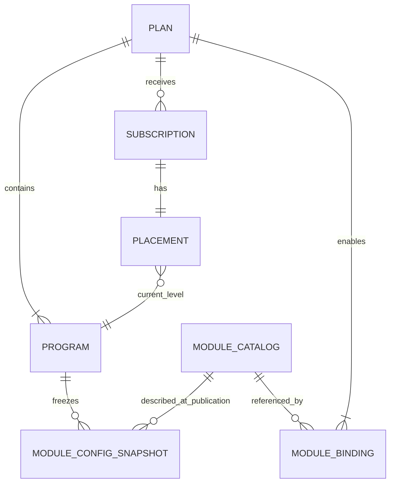

# Planes, programas y suscripciones IB — BDS

- **Versión:** 0.4
- **Estado:** base inicial

**Propósito:** definir la jerarquía comercial y de progresión del dominio IB.

## Contexto

Un Plan IB es el producto al que se suscribe un usuario. El plan define qué módulos pueden generar actividad recompensable y contiene programas que representan niveles de crecimiento. Los módulos son independientes: la indisponibilidad o ausencia de uno no debe impedir que los restantes contribuyan.

## Glosario

| Concepto | Definición |
| --- | --- |
| Plan IB | Producto comercial y elemento de mayor jerarquía de la suscripción. |
| Plan dedicado | Plan cuya configuración favorece la actividad de un módulo o perfil de negocio concreto. |
| Plan mixto | Plan que combina de forma deliberada contribuciones y recompensas de varios módulos. |
| Programa IB | Nivel de crecimiento dentro de un plan. |
| Módulo | Dominio externo que produce actividad, por ejemplo Broker, Copy Trading, Prop Firm o Hedge Fund. |
| Catálogo de módulos | Registro duradero de los módulos que IB reconoce, su disponibilidad y las capacidades que implementa cada uno. |
| Capacidad de módulo | Vocabulario de actividad o comportamiento implementado por un módulo, como trades, depósitos o compras de challenges. No es una facultad concedida administrativamente. |
| Snapshot de módulo del programa | Copia inmutable de la semántica y capacidades del módulo utilizadas por una configuración publicada del programa. |
| Disponibilidad de módulo | Condición activa o inactiva que determina si el módulo puede seleccionarse y participar en cualquier procesamiento. |
| Estado de procesamiento | Condición `running` o `paused` que permite operar normalmente o suspender cálculos y pagos sin detener la captura de actividad. |
| Vinculación de módulo | Configuración que habilita un módulo para un plan y permite identificar su fuente de actividad. |
| Suscripción | Relación del usuario IB con un plan. |
| Placement | Programa actual del usuario dentro del plan suscrito. |

## Relaciones

## Reglas de dominio

| ID | Regla |
| --- | --- |
| BR-PLAN-001 | El Plan IB es la unidad a la que se suscribe el usuario. El usuario no se suscribe directamente a un módulo ni a un programa. |
| BR-PLAN-002 | Un programa pertenece a un único plan y representa un nivel de crecimiento dentro de él. |
| BR-PLAN-003 | El plan determina explícitamente qué módulos están habilitados para producir progresión o recompensas. |
| BR-PLAN-004 | Un plan puede ser dedicado a un módulo o combinar varios módulos; ambos utilizan el mismo modelo de dominio. |
| BR-PLAN-005 | La participación de Copy Trading, Prop Firm o cualquier módulo futuro no depende de que Broker esté habilitado o disponible. |
| BR-PLAN-006 | Un módulo no habilitado por el plan no puede generar contribuciones ni recompensas para sus suscripciones. |
| BR-MODULE-001 | IB mantiene un catálogo duradero y autoritativo de los módulos que reconoce. |
| BR-MODULE-002 | Cada módulo tiene una identidad estable, una disponibilidad, un estado de procesamiento y un conjunto explícito de capacidades implementadas. |
| BR-MODULE-003 | Una nueva vinculación de plan solo puede referenciar un módulo activo y reconocido por el catálogo. |
| BR-MODULE-004 | Un programa solo puede configurar actividad compatible con las capacidades implementadas por el módulo correspondiente. |
| BR-MODULE-005 | El catálogo describe capacidades del módulo; no define ponderaciones, progresión ni reglas económicas del programa. |
| BR-MODULE-006 | El catálogo de módulos no se versiona como un agregado completo. |
| BR-MODULE-007 | Al publicar una configuración de programa se conserva un snapshot de la semántica y capacidades de módulo que justifican su ejecución. |
| BR-MODULE-008 | La configuración del programa mantiene además una relación directa con el registro del módulo para consultar su disponibilidad y estado de procesamiento actuales. |
| BR-MODULE-009 | La disponibilidad y el estado de procesamiento no forman parte del snapshot; cambiarlos no crea una nueva versión de catálogo ni de programa. |
| BR-MODULE-010 | Pausar el procesamiento de un módulo detiene sus cálculos y pagos, pero mantiene la ingesta de eventos y las consultas de actividad necesarias para conservar el período configurado. |
| BR-MODULE-011 | Un módulo con procesamiento pausado continúa activo y puede seleccionarse en configuraciones nuevas. |
| BR-MODULE-012 | Desactivar un módulo prevalece sobre configuraciones publicadas: impide nuevas selecciones, ingesta de eventos, consultas de actividad externa, cálculos y pagos. |
| BR-MODULE-013 | Un módulo que haya sido referenciado permanece en el catálogo y conserva sus relaciones e historial cuando se desactiva; no se elimina física ni lógicamente. |
| BR-MODULE-014 | Una capacidad solo puede declararse para un módulo cuando existe una implementación que la respalda; una acción administrativa no puede conceder capacidades. |
| BR-MODULE-015 | Todo evento rechazado por inactividad del módulo deja evidencia auditable, aunque no se incorpore como actividad del dominio. |
| BR-PROGRAM-001 | Todo placement pertenece a una suscripción y señala un programa del mismo plan de esa suscripción. |
| BR-PROGRAM-002 | La progresión automática solo cambia el programa del usuario dentro del plan al que está suscrito. |
| BR-PROGRAM-003 | Los programas del plan mantienen un orden y umbrales no ambiguos para determinar el placement. |
| BR-SUBSCRIPTION-001 | Una suscripción activa es requisito para tener placement y participar en progresión o recompensas. |
| BR-SUBSCRIPTION-002 | Cambiar de programa no sustituye ni recrea la suscripción al plan. |

## Ejemplos de producto

Los siguientes nombres ilustran configuraciones posibles y no fijan el catálogo definitivo:

- `Fx Prop Firm`: orientado a usuarios con buen desempeño sobre productos Prop Firm.
- `Hedge Fund`: orientado a actividad relacionada con capital gestionado y depósitos.
- `Broker`: orientado a volumen y actividad financiera de cuentas Broker.
- `Mix`: combina ponderaciones de varios módulos para usuarios versátiles.

## Eventos de negocio

- Plan publicado.
- Módulo incorporado al catálogo.
- Capacidades de un módulo modificadas.
- Módulo activado o desactivado.
- Procesamiento de un módulo pausado o reanudado.
- Módulo habilitado o retirado de un plan.
- Usuario suscrito a un plan.
- Placement inicial asignado.
- Usuario movido a otro programa por progresión.
- Placement modificado administrativamente.

## Decisiones pendientes

- Cantidad máxima de suscripciones activas o pendientes por usuario en todo el sistema.
- Política al retirar un módulo de un plan con suscripciones activas.
- Reglas para publicar una nueva versión del plan y aplicarla a suscripciones existentes.
- Política de anclaje administrativo de placements.
- Tratamiento y reanudación de actividad acumulada mientras un cálculo permanece pausado.
