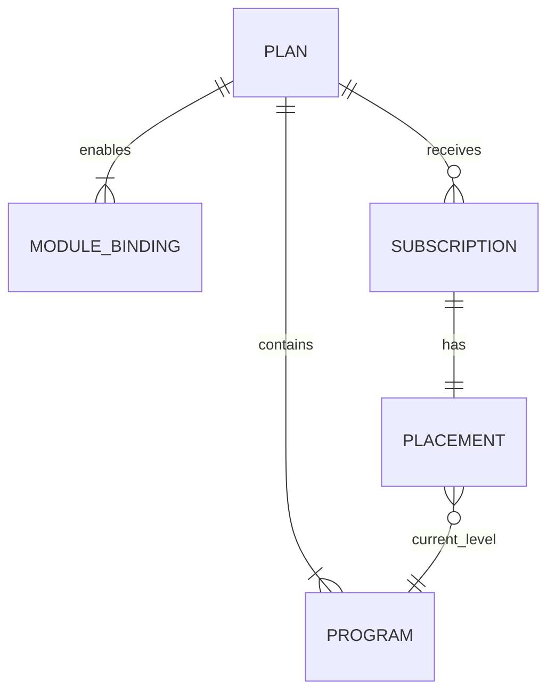

# Planes, programas y suscripciones IB — BDS

- **Versión:** 0.1
- **Estado:** base inicial

**Propósito:** definir la jerarquía comercial y de progresión del dominio IB.

## Contexto

Un Plan IB es el producto al que se suscribe un usuario. El plan define qué módulos pueden generar actividad recompensable y contiene programas que representan niveles de crecimiento. Los módulos son independientes: la indisponibilidad o ausencia de uno no debe impedir que los restantes contribuyan.

## Glosario

| Concepto | Definición |
| --- | --- |
| Plan IB | Producto comercial y elemento de mayor jerarquía de la suscripción. |
| Plan dedicado | Plan cuya configuración favorece la actividad de un módulo o perfil de negocio concreto. |
| Plan mixto | Plan que combina de forma deliberada contribuciones y recompensas de varios módulos. |
| Programa IB | Nivel de crecimiento dentro de un plan. |
| Módulo | Dominio externo que produce actividad, por ejemplo Broker, Copy Trading, Prop Firm o Hedge Fund. |
| Vinculación de módulo | Configuración que habilita un módulo para un plan y permite identificar su fuente de actividad. |
| Suscripción | Relación del usuario IB con un plan. |
| Placement | Programa actual del usuario dentro del plan suscrito. |

## Relaciones

## Reglas de dominio

| ID | Regla |
| --- | --- |
| BR-PLAN-001 | El Plan IB es la unidad a la que se suscribe el usuario. El usuario no se suscribe directamente a un módulo ni a un programa. |
| BR-PLAN-002 | Un programa pertenece a un único plan y representa un nivel de crecimiento dentro de él. |
| BR-PLAN-003 | El plan determina explícitamente qué módulos están habilitados para producir progresión o recompensas. |
| BR-PLAN-004 | Un plan puede ser dedicado a un módulo o combinar varios módulos; ambos utilizan el mismo modelo de dominio. |
| BR-PLAN-005 | La participación de Copy Trading, Prop Firm o cualquier módulo futuro no depende de que Broker esté habilitado o disponible. |
| BR-PLAN-006 | Un módulo no habilitado por el plan no puede generar contribuciones ni recompensas para sus suscripciones. |
| BR-PROGRAM-001 | Todo placement pertenece a una suscripción y señala un programa del mismo plan de esa suscripción. |
| BR-PROGRAM-002 | La progresión automática solo cambia el programa del usuario dentro del plan al que está suscrito. |
| BR-PROGRAM-003 | Los programas del plan mantienen un orden y umbrales no ambiguos para determinar el placement. |
| BR-SUBSCRIPTION-001 | Una suscripción activa es requisito para tener placement y participar en progresión o recompensas. |
| BR-SUBSCRIPTION-002 | Cambiar de programa no sustituye ni recrea la suscripción al plan. |

## Ejemplos de producto

Los siguientes nombres ilustran configuraciones posibles y no fijan el catálogo definitivo:

- `Fx Prop Firm`: orientado a usuarios con buen desempeño sobre productos Prop Firm.
- `Hedge Fund`: orientado a actividad relacionada con capital gestionado y depósitos.
- `Broker`: orientado a volumen y actividad financiera de cuentas Broker.
- `Mix`: combina ponderaciones de varios módulos para usuarios versátiles.

## Eventos de negocio

- Plan publicado.
- Módulo habilitado o retirado de un plan.
- Usuario suscrito a un plan.
- Placement inicial asignado.
- Usuario movido a otro programa por progresión.
- Placement modificado administrativamente.

## Decisiones pendientes

- Cantidad máxima de suscripciones activas o pendientes por usuario en todo el sistema.
- Política al retirar un módulo de un plan con suscripciones activas.
- Reglas para publicar una nueva versión del plan y aplicarla a suscripciones existentes.
- Política de anclaje administrativo de placements.
