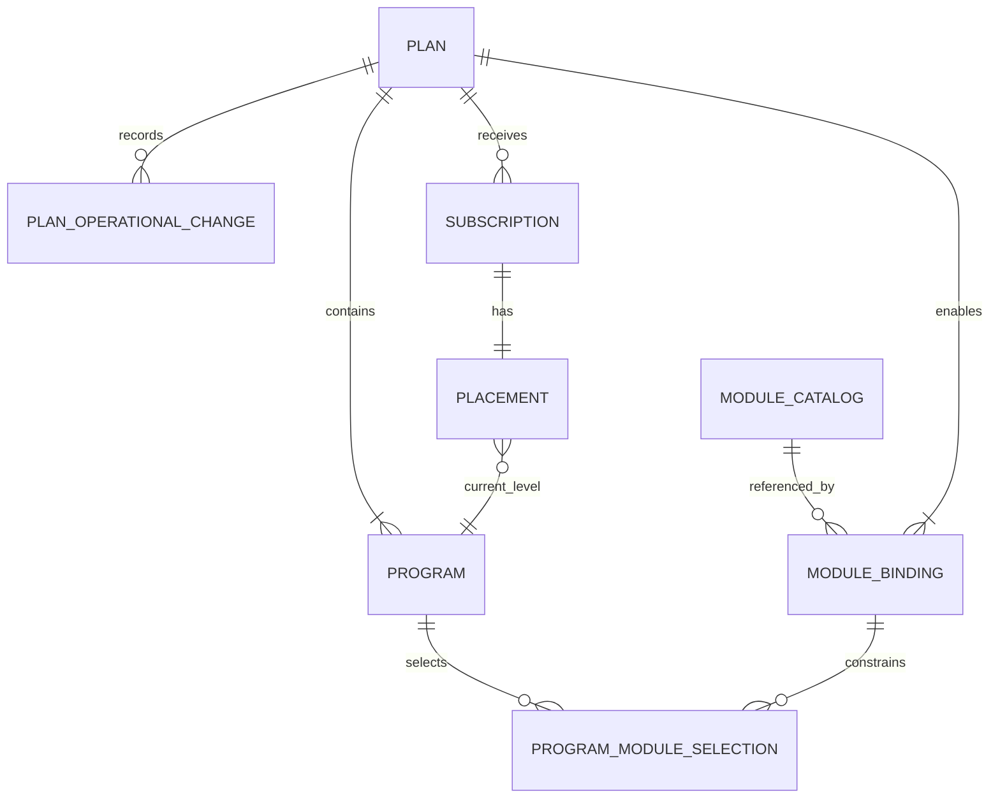

# Planes, programas y suscripciones IB — BDS

- **Versión:** 0.10
- **Estado:** base inicial; P1 cierra el ciclo de vida administrativo del plan; PR1 cierra identidad y selección administrativa del programa; P2 cierra el umbral de entrada vivo y el ladder del plan

**Propósito:** definir la jerarquía comercial y de progresión del dominio IB.

## Contexto

Un Plan IB es el producto al que se suscribe un usuario. El plan define qué módulos pueden generar actividad recompensable y contiene programas que representan niveles de crecimiento. Los módulos son independientes: la indisponibilidad o ausencia de uno no debe impedir que los restantes contribuyan.

## Glosario

| Concepto | Definición |
| --- | --- |
| Plan IB | Producto comercial y elemento de mayor jerarquía de la suscripción. |
| Plan dedicado | Plan cuya configuración favorece la actividad de un módulo o perfil de negocio concreto. |
| Plan mixto | Plan que combina de forma deliberada contribuciones y recompensas de varios módulos. |
| Programa IB | Nivel de crecimiento dentro de un plan. Tiene código estable, nombre y descripción opcional. |
| Código del programa | Identidad de negocio del programa, estable y única dentro de su plan. |
| Selección de módulo del programa | Relación que asocia al programa un módulo ya habilitado por su plan. Puede permanecer vacía. |
| Módulo | Dominio externo que produce actividad, por ejemplo Broker, Copy Trading, Prop Firm o Hedge Fund. |
| Catálogo de módulos | Registro duradero de los módulos que IB reconoce, su disponibilidad y las capacidades que implementa cada uno. |
| Capacidad de módulo | Vocabulario de actividad o comportamiento implementado por un módulo, como trades, depósitos o compras de challenges. No es una facultad concedida administrativamente. |
| Disponibilidad de módulo | Condición activa o inactiva que determina si el módulo puede seleccionarse y participar en cualquier procesamiento. |
| Estado de procesamiento | Condición `running` o `paused` que permite operar normalmente o suspender cálculos y pagos sin detener la captura de actividad. |
| Vinculación de módulo | Relación que habilita un módulo para un plan. Identifica el módulo reconocido por el catálogo; la fuente de actividad concreta permanece fuera de esta fase. |
| Módulo operativo | Módulo activo en el catálogo, aunque su procesamiento esté pausado. |
| Disponibilidad del plan | Condición activa o inactiva del plan. No equivale a publicación ni a una versión. |
| Archivo del plan | Retiro lógico e irreversible en esta fase de un plan inactivo. Conserva identidad, código y vinculaciones. |
| Desactivación automática del plan | Paso a inactivo cuando un plan activo queda sin módulos operativos porque el catálogo desactivó módulos. |
| Suscripción | Relación del usuario IB con un plan. |
| Placement | Programa actual del usuario dentro del plan suscrito. |
| Umbral de entrada | Entero no negativo asociado a un programa: suelo de puntos a partir del cual ese nivel es alcanzable. |
| Ladder de programas | Secuencia ordenada de programas de un plan cuyos umbrales de entrada son estrictamente crecientes con la posición. Define intervalos contiguos sin solapes. |

## Relaciones

## Reglas de dominio

| ID | Regla |
| --- | --- |
| BR-PLAN-001 | El Plan IB es la unidad a la que se suscribe el usuario. El usuario no se suscribe directamente a un módulo ni a un programa. |
| BR-PLAN-002 | Un programa pertenece a un único plan y representa un nivel de crecimiento dentro de él. |
| BR-PLAN-003 | El plan determina explícitamente qué módulos están habilitados para producir progresión o recompensas. |
| BR-PLAN-004 | Un plan puede ser dedicado a un módulo o combinar varios módulos; ambos utilizan el mismo modelo de dominio. |
| BR-PLAN-005 | La participación de Copy Trading, Prop Firm o cualquier módulo futuro no depende de que Broker esté habilitado o disponible. |
| BR-PLAN-006 | Un módulo no habilitado por el plan no puede generar contribuciones ni recompensas para sus suscripciones. |
| BR-PLAN-007 | Un plan nace inactivo. Puede existir temporalmente sin vinculaciones. |
| BR-PLAN-008 | El código del plan es una identidad de negocio estable, única e irreutilizable, también después de archivarse. |
| BR-PLAN-009 | Activar un plan exige al menos una vinculación cuyo módulo esté operativo en ese momento. |
| BR-PLAN-010 | Un plan activo puede editarse si conserva al menos una vinculación. Un conjunto vacío de vinculaciones solo es válido mientras el plan está inactivo. |
| BR-PLAN-011 | Una vinculación nueva solo puede referenciar un módulo operativo. Las vinculaciones ya existentes se conservan aunque el módulo deje de estar operativo. |
| BR-PLAN-012 | Un módulo pausado sigue siendo operativo para nuevas vinculaciones y para mantener un plan activo. |
| BR-PLAN-013 | Si un plan activo queda sin módulos operativos porque el catálogo desactiva módulos, el plan se desactiva. La desactivación del módulo no espera a ese ajuste. |
| BR-PLAN-014 | Reactivar un módulo no reactiva planes desactivados automática o administrativamente. |
| BR-PLAN-015 | Solo un plan inactivo puede archivarse. El archivo conserva las vinculaciones y no se revierte en esta fase. |
| BR-PLAN-016 | Un cambio de disponibilidad del plan es atribuible: actor administrativo, o actor de sistema con la causa que lo originó. |
| BR-MODULE-001 | IB mantiene un catálogo duradero y autoritativo de los módulos que reconoce. |
| BR-MODULE-002 | Cada módulo tiene una identidad estable, una disponibilidad, un estado de procesamiento y un conjunto explícito de capacidades implementadas. |
| BR-MODULE-003 | Una nueva vinculación de plan solo puede referenciar un módulo activo y reconocido por el catálogo. |
| BR-MODULE-004 | Un programa solo puede configurar actividad compatible con las capacidades implementadas por el módulo correspondiente. |
| BR-MODULE-005 | El catálogo describe capacidades del módulo; no define ponderaciones, progresión ni reglas económicas del programa. |
| BR-MODULE-006 | El catálogo de módulos no se versiona como un agregado completo. |
| BR-MODULE-007 | El programa no congela semántica ni capacidades del módulo. Conserva únicamente la selección como referencia al registro del catálogo. |
| BR-MODULE-008 | Cualquier consumidor posterior consulta semántica, capacidades, disponibilidad y estado de procesamiento vigentes en el catálogo de módulos. |
| BR-MODULE-009 | Un cambio de disponibilidad o procesamiento del módulo no versiona el programa ni su umbral de entrada. Planes y programas conservan identidad estable y no se versionan. |
| BR-MODULE-010 | Pausar el procesamiento de un módulo detiene sus cálculos y pagos, pero mantiene la ingesta de eventos y las consultas de actividad necesarias para conservar el período configurado. |
| BR-MODULE-011 | Un módulo con procesamiento pausado continúa activo y puede seleccionarse en configuraciones nuevas. |
| BR-MODULE-012 | Desactivar un módulo prevalece sobre selecciones y programas existentes: impide nuevas selecciones, ingesta de eventos, consultas de actividad externa, cálculos y pagos. |
| BR-MODULE-013 | Un módulo que haya sido referenciado permanece en el catálogo y conserva sus relaciones e historial cuando se desactiva; no se elimina física ni lógicamente. |
| BR-MODULE-014 | Una capacidad solo puede declararse para un módulo cuando existe una implementación que la respalda; una acción administrativa no puede conceder capacidades. |
| BR-MODULE-015 | Todo evento rechazado por inactividad del módulo deja evidencia auditable, aunque no se incorpore como actividad del dominio. |
| BR-MODULE-016 | Un módulo incorporado por primera vez al catálogo nace activo y con procesamiento en ejecución. Una sincronización posterior nunca reactiva automáticamente un módulo desactivado. |
| BR-MODULE-017 | Una capacidad retirada de su implementación permanece en el catálogo como inactiva para conservar trazabilidad. Si vuelve a estar respaldada por una implementación, se reactiva automáticamente. |
| BR-MODULE-018 | Un cambio de disponibilidad o procesamiento afecta a los trabajos que comiencen después del cambio. Los trabajos que ya habían comenzado pueden completar sus efectos conforme al estado que validaron al iniciar. |
| BR-PROGRAM-001 | Todo placement pertenece a una suscripción y señala un programa del mismo plan de esa suscripción. |
| BR-PROGRAM-002 | La progresión automática solo cambia el programa del usuario dentro del plan al que está suscrito. |
| BR-PROGRAM-003 | Los programas del plan mantienen un orden y umbrales no ambiguos para determinar el placement. |
| BR-PROGRAM-004 | El código del programa es una identidad de negocio estable, única dentro de su plan e irreutilizable dentro de ese plan. |
| BR-PROGRAM-005 | Un programa puede existir sin módulos seleccionados, incluso si su plan está activo. |
| BR-PROGRAM-006 | El umbral de entrada y el orden del programa no dependen de que haya módulos seleccionados. |
| BR-PROGRAM-007 | La selección de módulos de un programa es siempre un subconjunto de las vinculaciones del plan propietario. |
| BR-PROGRAM-008 | Activar, desactivar o archivar el plan no crea, elimina ni altera por sí solo los programas de ese plan. |
| BR-PROGRAM-009 | Solo un plan no archivado admite crear, editar o reordenar sus programas. |
| BR-PROGRAM-010 | Cada programa declara un único umbral de entrada: un entero no negativo. No se modelan rangos min-max ni un máximo nulo en el último nivel. |
| BR-PROGRAM-011 | Los umbrales de entrada de los programas de un mismo plan son estrictamente crecientes con la posición del ladder. |
| BR-PROGRAM-012 | El intervalo efectivo del programa en posición `i` es `[umbral_i, umbral_{i+1})`. El del último programa es `[umbral_n, ∞)`. Los intervalos son contiguos y no se solapan. |
| BR-PROGRAM-013 | El placement por progresión sitúa al IB en el programa de mayor posición del plan tal que `puntos >= umbral_de_entrada` de ese programa. |
| BR-PROGRAM-014 | El umbral de entrada es mutable. Un cambio válido del ladder afecta a las evaluaciones posteriores que lo lean; no se conserva un snapshot de umbral por usuario, placement ni run. |
| BR-SUBSCRIPTION-001 | Una suscripción activa es requisito para tener placement y participar en progresión o recompensas. |
| BR-SUBSCRIPTION-002 | Cambiar de programa no sustituye ni recrea la suscripción al plan. |

## Ladder de umbrales

El ladder no usa un par min-max por programa. Un solo umbral de entrada por
nivel, ordenado de forma estrictamente creciente, produce el mismo resultado
sin solapes ni casos especiales en el último programa. El umbral vive en el
programa y se lee vigente en cada evaluación posterior.

Ejemplo con tres programas:

| Posición | Código | Umbral de entrada | Intervalo efectivo |
| --- | --- | --- | --- |
| 1 | basic | 0 | `[0, 100)` |
| 2 | advanced | 100 | `[100, 500)` |
| 3 | pro | 500 | `[500, ∞)` |

Con 99 puntos el placement es `basic`; con 100, `advanced`; con 500 o más,
`pro`.

## Estados del plan

| Disponibilidad | Archivo | Condición efectiva |
| --- | --- | --- |
| inactivo | no | Editable; puede no tener módulos; no admite suscripción futura en esta fase. |
| activo | no | Editable si conserva al menos una vinculación; requiere módulos operativos para permanecer coherente. |
| inactivo | sí | Archivado: no se consulta en el catálogo vigente, conserva código y vinculaciones, no se restaura. |

Un plan nunca está activo y archivado a la vez. Activar y desactivar no publican una versión.

## Ejemplos de producto

Los siguientes nombres ilustran configuraciones posibles y no fijan el catálogo definitivo:

- `Fx Prop Firm`: orientado a usuarios con buen desempeño sobre productos Prop Firm.
- `Hedge Fund`: orientado a actividad relacionada con capital gestionado y depósitos.
- `Broker`: orientado a volumen y actividad financiera de cuentas Broker.
- `Mix`: combina ponderaciones de varios módulos para usuarios versátiles.

## Eventos de negocio

- Plan creado.
- Plan activado o desactivado administrativamente.
- Plan desactivado automáticamente al quedar sin módulos operativos.
- Módulo habilitado o retirado de un plan.
- Plan archivado.
- Plan publicado.
- Programa creado o editado dentro de un plan.
- Programas de un plan reordenados.
- Módulos seleccionados o retirados de un programa.
- Umbral de entrada de un programa definido o modificado.
- Ladder de programas de un plan reconfigurado.
- Módulo incorporado al catálogo.
- Capacidades de un módulo modificadas.
- Módulo activado o desactivado.
- Procesamiento de un módulo pausado o reanudado.
- Usuario suscrito a un plan.
- Placement inicial asignado.
- Usuario movido a otro programa por progresión.
- Placement modificado administrativamente.

## Decisiones pendientes

- Cantidad máxima de suscripciones activas o pendientes por usuario en todo el sistema.
- Política al retirar un módulo de un plan con suscripciones activas.
- Reglas para publicar una nueva versión del plan y aplicarla a suscripciones existentes.
- Política de anclaje administrativo de placements.
- Tratamiento y reanudación de actividad acumulada mientras un cálculo permanece pausado.
- Forma concreta de evidencia auditable de eventos rechazados por inactividad del módulo (BR-MODULE-015).
- Restauración de un plan archivado.
