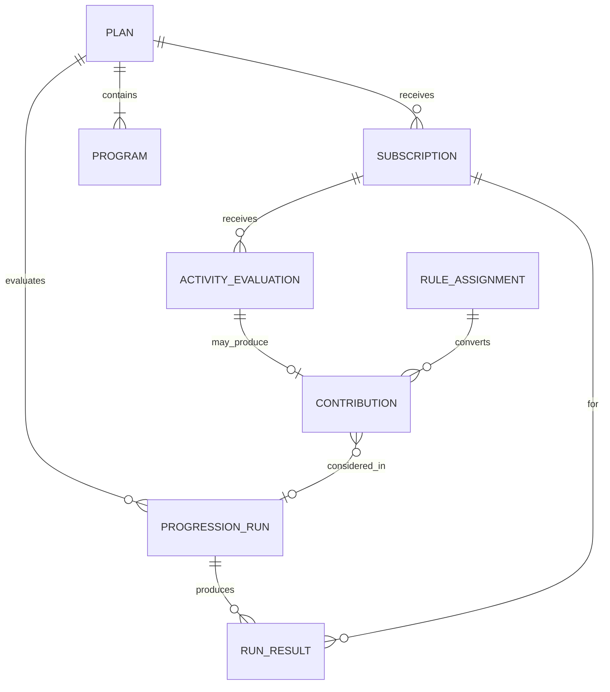
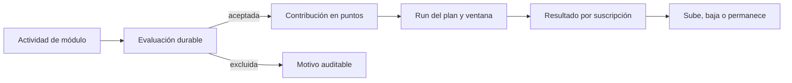
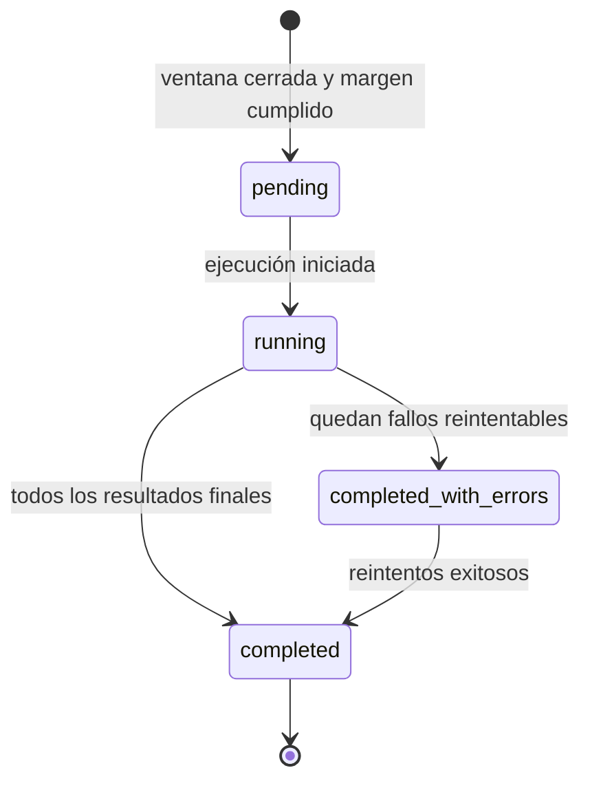

# Progresión multi-módulo por puntos — BDS

- **Versión:** 0.6
- **Estado:** base ampliada; cierra ventanas, elegibilidad, evaluación, runs, unicidad de reglas y catálogo inicial de motivos de exclusión para PG1/PG2

**Propósito:** normalizar actividades heterogéneas para que todos los módulos habilitados puedan contribuir al crecimiento del IB.

## Contexto

Broker, Copy Trading, Prop Firm y Hedge Fund no producen una misma unidad de actividad. La progresión convierte cantidades nativas —lotes, depósitos, compras de challenge u otras métricas— a puntos sin dimensión. Un run evalúa los puntos aplicables y determina si el usuario sube, baja o permanece en su programa.

Los puntos solo representan progreso. No son dinero, saldo, recompensa canjeable ni obligación financiera.

La conversión a puntos reutiliza el catálogo de reglas del plan: identidad, versiones publicadas e inmutables y asignaciones históricas a programa y módulo. Progression no mantiene un catálogo paralelo de reglas de contribución.

## Glosario

| Concepto | Definición |
| --- | --- |
| Métrica nativa | Cantidad emitida por un módulo en su unidad original. |
| Regla de contribución | Regla del catálogo del plan cuya estrategia convierte una métrica nativa en puntos de progresión. En esta fase la estrategia aplicable es `points_per_quantity_unit`. |
| Ponderación | Proporción que determina cuántos puntos aporta una unidad de la métrica. |
| Contribución | Hecho auditable que registra la actividad aceptada, la regla y versión aplicadas y los puntos obtenidos. |
| Evaluación de actividad | Registro durable del resultado de procesar una actividad para progresión: aceptada con contribución, o excluida con motivo. |
| Puntos de progresión | Unidad común utilizada exclusivamente para evaluar placement. |
| Período de progresión | Configuración obligatoria del plan que define la duración y alineación de cada ventana: `daily`, `weekly` o `monthly`, en UTC. |
| Ventana de progresión | Intervalo fijo no solapado derivado del período del plan. Los puntos se reinician en cada ventana. |
| Margen técnico de cierre | Espera global de una hora tras el fin de la ventana antes de ejecutar el run que la cierra. |
| Actividad tardía | Actividad cuya ocurrencia pertenece a una ventana ya cerrada por un run. Se conserva en evaluación sin otorgar puntos. |
| Run de progresión | Evaluación de un plan para una ventana concreta. Produce un resultado independiente por cada suscripción evaluada. |
| Resultado de run | Outcome por suscripción dentro de un run: puntos del período, programa objetivo y efecto sobre el placement, u omisión o fallo reintentable. |
| Scope de instrumentos | Conjunto de instrumentos de un módulo a los que aplica una regla. |

## Relaciones

## Flujo de dominio

## Reglas de dominio

| ID | Regla |
| --- | --- |
| BR-POINTS-001 | Toda contribución conserva la métrica nativa, su unidad, la regla aplicada y los puntos resultantes. |
| BR-POINTS-002 | Los puntos se utilizan únicamente para progresión; nunca se pagan ni se incorporan a un balance financiero. |
| BR-POINTS-003 | Solo los módulos habilitados por el plan y seleccionados por el programa vigente al ocurrir la actividad pueden aportar puntos. Un programa sin selecciones no genera puntos. |
| BR-POINTS-004 | Una regla de contribución identifica el módulo, tipo de métrica, ponderación y, cuando corresponde, scope de instrumentos. |
| BR-POINTS-005 | Un instrumento con el mismo nombre comercial en módulos distintos conserva bindings independientes y puede tener ponderaciones diferentes. |
| BR-POINTS-006 | Una actividad solo produce contribución si satisface el módulo, la métrica y el scope configurados por la regla. |
| BR-POINTS-007 | La conversión utiliza aritmética decimal exacta. Cantidades, ponderaciones y puntos admiten como máximo ocho decimales; una entrada con mayor escala se rechaza y no se redondea en silencio. |
| BR-POINTS-008 | Toda contribución es idempotente respecto a la actividad fuente, beneficiario y versión de regla. |
| BR-POINTS-009 | Una contribución registrada no se recalcula silenciosamente cuando cambia una ponderación; las nuevas condiciones requieren otra versión de regla. |
| BR-POINTS-010 | Un run puede mantener, subir o bajar el placement según los puntos y umbrales aplicables. |
| BR-POINTS-011 | Todos los módulos de un plan mixto contribuyen mediante el mismo ledger y mecanismo de evaluación, aunque utilicen métricas y ponderaciones diferentes. |
| BR-POINTS-012 | El procesamiento pausado de un módulo impide calcular nuevas contribuciones suyas aunque las selecciones y umbrales del programa permanezcan vigentes. |
| BR-POINTS-013 | La actividad del módulo consultada durante una pausa se conserva. Al reanudar se procesa solo si su ventana original sigue abierta; si la ventana ya cerró, permanece en evaluación sin puntos. |
| BR-POINTS-014 | Un módulo inactivo no consulta actividad y no genera contribuciones nuevas. |
| BR-POINTS-015 | La suscripción, el placement y la asignación o versión de regla aplicables a una actividad son los vigentes en el instante de ocurrencia. Los umbrales del ladder se leen vigentes al ejecutar el run. |
| BR-POINTS-016 | Existe como máximo una asignación activa de estrategia `points_per_quantity_unit` por combinación de programa, módulo y métrica o unidad. El mismo tipo de estrategia puede repetirse en el módulo solo para métricas o unidades distintas. |
| BR-POINTS-017 | Una misma actividad no recibe dos ponderaciones para la misma métrica. El total de la ventana suma contribuciones válidas de métricas y módulos distintos. |
| BR-POINTS-018 | Cada plan declara un período de progresión obligatorio: `daily`, `weekly` o `monthly`, alineado en UTC. No existe plan sin período. |
| BR-POINTS-019 | Los puntos de una suscripción se reinician en cada ventana fija del plan. No se utiliza ventana móvil en esta fase. |
| BR-POINTS-020 | Tras el fin de una ventana media una hora de margen técnico global antes de ejecutar el run. La actividad cuya ocurrencia pertenece a la ventana y se obtiene antes de ejecutar el run puede otorgar puntos; la posterior es actividad tardía. |
| BR-POINTS-021 | La actividad tardía produce una evaluación durable sin contribución de puntos. |
| BR-POINTS-022 | Toda actividad procesada para progresión deja una evaluación durable, aceptada o excluida, con resultado y motivo visibles para administración. |
| BR-POINTS-023 | Un run pertenece a un plan y a una ventana. Produce un resultado independiente por cada suscripción evaluada. |
| BR-POINTS-024 | El programa objetivo del run es el de mayor posición cuyo umbral de entrada se cumple con los puntos de la ventana. El placement puede saltar varios niveles en una sola dirección. |
| BR-POINTS-025 | Cero puntos de la ventana resuelven el primer programa del ladder. |
| BR-POINTS-026 | Una suscripción activada a mitad de una ventana participa en el cierre de esa ventana con la actividad elegible ocurrida desde su activación. |
| BR-POINTS-027 | Si falla la evaluación de una suscripción, las demás continúan. El run puede terminar con errores parciales; solo los resultados fallidos se reintentan de forma idempotente. Un run completado no se reabre. |
| BR-POINTS-028 | Mientras el plan está inactivo, Progression no inicia consultas de actividad, evaluaciones, contribuciones ni runs para sus suscripciones. Reactivar el plan no recupera actividad previa: solo es elegible la ocurrida desde la reactivación. Una evaluación que alcance su verificación final con el plan inactivo queda excluida y no se difiere. |
| BR-POINTS-029 | Retirar un módulo del plan o del programa deja de aportar puntos desde el instante del retiro. Las contribuciones previas permanecen válidas. |
| BR-POINTS-030 | En esta fase no se convierten monedas distintas. Solo se acepta actividad cuya unidad coincide con la unidad de la regla aplicable. |
| BR-POINTS-031 | Administración consulta evaluaciones, contribuciones, runs y resultados. El usuario IB no consulta estos artefactos mediante este dominio. |

## Ejemplos de conversión

Los valores siguientes son ilustrativos:

| Módulo | Métrica | Ponderación | Actividad | Resultado |
| --- | --- | --- | --- | --- |
| Hedge Fund | Depósito confirmado | 0.1 puntos por USD | USD 100 | 10 puntos |
| Prop Firm | Challenge comprado | 25 puntos por compra | 1 challenge | 25 puntos |
| Broker | Depósito confirmado | 0.1 puntos por USD | USD 100 | 10 puntos |
| Broker | Volumen cerrado | 50 puntos por lote | 0.1 lotes | 5 puntos |

Broker puede tener dos reglas `points_per_quantity_unit` activas en el mismo programa si las unidades difieren (`lot` y depósito en USD). No puede tener dos ponderaciones activas para la misma unidad.

## Auditoría de una contribución

Una contribución debe poder responder:

- Qué actividad la originó.
- Qué usuario y suscripción se beneficiaron.
- Qué plan y programa estaban vigentes al ocurrir.
- Qué módulo, métrica e instrumento participaron.
- Qué regla y versión realizaron la conversión.
- Cuál fue el valor original y cuántos puntos produjo.
- En qué run fue considerada.

Una evaluación excluida debe poder responder el mismo contexto de actividad y el motivo de la exclusión.

## Motivos de exclusión iniciales

El catálogo inicial de motivos visibles a administración es cerrado para esta
fase. Cada evaluación excluida conserva exactamente uno:

| Motivo | Condición |
| --- | --- |
| `placement_fixed` | El placement estaba fijado cuando ocurrió la actividad. |
| `plan_inactive` | El plan no estaba activo en la verificación final de la evaluación. No se difiere ni recupera actividad mientras el plan permanece inactivo. |
| `module_not_selected` | El módulo no estaba seleccionado por el programa vigente al ocurrir. |
| `module_inactive` | El módulo estaba inactivo. |
| `unit_mismatch` | La unidad de la actividad no coincide con la de la regla aplicable. |
| `scale_exceeded` | La cantidad o ponderación supera ocho decimales. |
| `window_closed_after_pause` | La actividad se consultó durante una pausa y, al reanudar, su ventana ya había cerrado. |
| `late_activity` | La ocurrencia pertenece a una ventana ya cerrada por un run. |
| `no_active_subscription` | No existía suscripción activa del beneficiario al ocurrir. |
| `no_applicable_rule` | No había asignación vigente `points_per_quantity_unit` para programa, módulo y métrica/unidad. |

Ampliar el catálogo requiere una decisión de dominio explícita; no se inventan
motivos ad hoc en implementación.

## Estados del run

Un resultado por suscripción puede completarse, omitirse cuando la fijación o la condición del plan impiden evaluar, o fallar de forma reintentable. Completado no se reabre.

## Eventos de negocio

- Actividad evaluada y aceptada.
- Actividad evaluada y excluida.
- Contribución registrada.
- Ventana de progresión cerrada.
- Run de progresión iniciado.
- Run de progresión completado.
- Run de progresión completado con errores parciales.
- Resultado de run reintentado.
- Placement modificado por progresión.

## Fuera de esta fase

- Reversión de depósitos, cancelación o devolución de challenges y corrección de operaciones ya convertidas en contribución.
- Conversión de importes entre monedas distintas y fuente del tipo de cambio.
- Ventana móvil o políticas mixtas de acumulación.
- Scope instrumental distinto de `all`.

## Decisiones pendientes

- Política de reversas y compensaciones sobre contribuciones ya registradas.
- Conversión FX y autoridad de la tasa cuando la métrica monetaria no coincida con la unidad de la regla.
