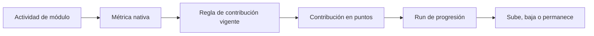

# Progresión multi-módulo por puntos — BDS

- **Versión:** 0.1
- **Estado:** base inicial

**Propósito:** normalizar actividades heterogéneas para que todos los módulos habilitados puedan contribuir al crecimiento del IB.

## Contexto

Broker, Copy Trading, Prop Firm y Hedge Fund no producen una misma unidad de actividad. La progresión convierte cantidades nativas —lotes, depósitos, compras de challenge u otras métricas— a puntos sin dimensión. Un run evalúa los puntos aplicables y determina si el usuario sube, baja o permanece en su programa.

Los puntos solo representan progreso. No son dinero, saldo, recompensa canjeable ni obligación financiera.

## Glosario

| Concepto | Definición |
| --- | --- |
| Métrica nativa | Cantidad emitida por un módulo en su unidad original. |
| Regla de contribución | Conversión versionada desde una métrica nativa hacia puntos. |
| Ponderación | Proporción que determina cuántos puntos aporta una unidad de la métrica. |
| Contribución | Hecho auditable que registra la actividad, regla aplicada y puntos obtenidos. |
| Puntos de progresión | Unidad común utilizada exclusivamente para evaluar placement. |
| Run de progresión | Evaluación delimitada que agrega contribuciones y resuelve el programa correspondiente. |
| Scope de instrumentos | Conjunto de instrumentos de un módulo a los que aplica una regla. |

## Flujo de dominio

## Reglas de dominio

| ID | Regla |
| --- | --- |
| BR-POINTS-001 | Toda contribución conserva la métrica nativa, su unidad, la regla aplicada y los puntos resultantes. |
| BR-POINTS-002 | Los puntos se utilizan únicamente para progresión; nunca se pagan ni se incorporan a un balance financiero. |
| BR-POINTS-003 | Solo los módulos habilitados por el plan pueden aportar puntos a sus suscripciones. |
| BR-POINTS-004 | Una regla de contribución identifica el módulo, tipo de métrica, ponderación y, cuando corresponde, scope de instrumentos. |
| BR-POINTS-005 | Un instrumento con el mismo nombre comercial en módulos distintos conserva bindings independientes y puede tener ponderaciones diferentes. |
| BR-POINTS-006 | Una actividad solo produce contribución si satisface el módulo, la métrica y el scope configurados por la regla. |
| BR-POINTS-007 | La conversión utiliza aritmética decimal y no pierde precisión mediante operaciones binarias de punto flotante. |
| BR-POINTS-008 | Toda contribución es idempotente respecto a la actividad fuente, beneficiario y versión de regla. |
| BR-POINTS-009 | Una contribución registrada no se recalcula silenciosamente cuando cambia una ponderación; las nuevas condiciones requieren otra versión de regla. |
| BR-POINTS-010 | Un run puede mantener, subir o bajar el placement según los puntos y umbrales aplicables. |
| BR-POINTS-011 | Todos los módulos de un plan mixto contribuyen mediante el mismo ledger y mecanismo de evaluación, aunque utilicen métricas y ponderaciones diferentes. |

## Ejemplos de conversión

Los valores siguientes son ilustrativos:

| Módulo | Métrica | Ponderación | Actividad | Resultado |
| --- | --- | --- | --- | --- |
| Hedge Fund | Depósito confirmado | 0.1 puntos por USD | USD 100 | 10 puntos |
| Prop Firm | Challenge comprado | 25 puntos por compra | 1 challenge | 25 puntos |
| Broker | Depósito confirmado | 0.1 puntos por USD | USD 100 | 10 puntos |
| Broker | Volumen cerrado | 50 puntos por lote | 0.1 lotes | 5 puntos |

## Auditoría de una contribución

Una contribución debe poder responder:

- Qué actividad la originó.
- Qué usuario y suscripción se beneficiaron.
- Qué plan y programa estaban vigentes.
- Qué módulo, métrica e instrumento participaron.
- Qué regla y versión realizaron la conversión.
- Cuál fue el valor original y cuántos puntos produjo.
- En qué run fue considerada.

## Decisiones pendientes

- Duración de las ventanas y alineación temporal de los runs.
- Si los puntos se reinician por período, utilizan una ventana móvil o admiten ambas políticas.
- Si un run puede saltar varios programas o solamente uno por dirección.
- Tratamiento de actividades tardías posteriores al cierre de un run.
- Reversión de depósitos, cancelación o devolución de challenges y corrección de operaciones.
- Conversión de importes en monedas diferentes y fuente del tipo de cambio congelado.
- Momento exacto que determina el programa y la regla aplicable: ocurrencia, ingestión o corte del run.
