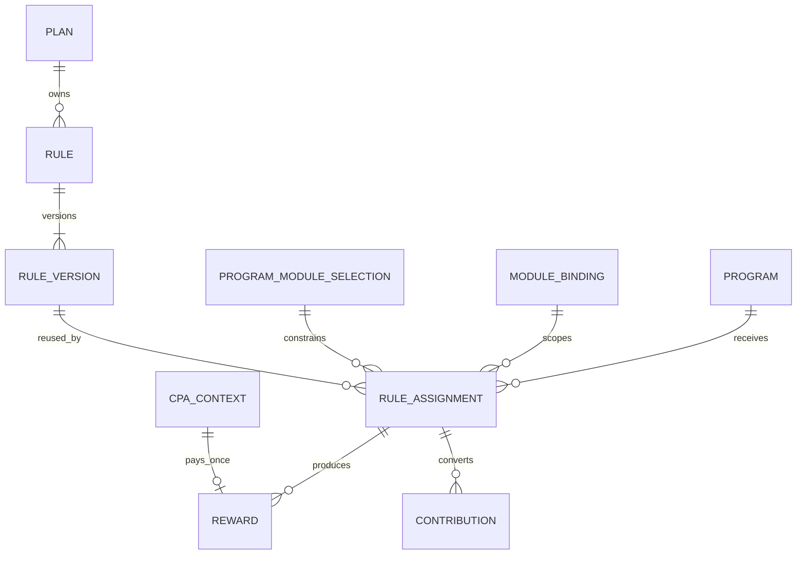

# Reglas y recompensas IB — BDS

- **Versión:** 0.6
- **Estado:** base inicial; R2 cierra asignaciones históricas con scope `all`; Progression reutiliza el catálogo de reglas para contribuciones por puntos

**Propósito:** definir reglas reutilizables, su asignación contextual y la trazabilidad de las recompensas.

## Contexto

CPA, volumen, PnL, puntos de progresión y futuras modalidades utilizan un pipeline común de evaluación y auditoría. Las diferencias se expresan mediante estrategias y configuraciones versionadas. Una regla puede compartirse entre varios programas del mismo plan sin duplicar su definición.

El catálogo de reglas —identidad, versiones publicadas e inmutables y asignaciones históricas— es único para Progression y Rewards. Progression consume estrategias de contribución; Rewards consume estrategias económicas. Ambos conservan la versión aplicada en sus resultados.

## Glosario

| Concepto | Definición |
| --- | --- |
| Regla | Política reutilizable que identifica una estrategia. Tiene un nombre único dentro del plan y un slug estable derivado de su nombre inicial. Puede destinarse a progresión o a recompensa según su tipo de estrategia. |
| Versión de regla | Configuración publicada e inmutable de una regla. |
| Asignación | Relación histórica que establece en qué programa, módulo, vigencia y scope aplica una versión de regla. |
| Asignación activa | Asignación cuyo intervalo de vigencia está abierto (`ends_at` nulo). |
| Scope de instrumentos | Alcance de instrumentos en el que aplica la asignación. En esta fase el único valor admitido es `all` (todos los instrumentos del módulo). |
| Estrategia | Tipo de cálculo que interpreta una configuración válida y produce una evaluación. |
| Recompensa | Obligación calculada a favor de un beneficiario. |
| Settlement | Confirmación de que la operación financiera solicitada fue asentada. |
| Contexto CPA | Snapshot que fija referido, plan, programa, asignación, versión de regla, scope y condiciones aplicables a una adquisición. |

## Relaciones



## Reglas de dominio

| ID | Regla |
| --- | --- |
| BR-RULE-001 | La identidad de una regla pertenece al plan y es independiente de un programa o módulo concreto. |
| BR-RULE-002 | Una versión de regla publicada es inmutable. Toda modificación crea una nueva versión. |
| BR-RULE-003 | Una misma versión puede asignarse a múltiples combinaciones de programa y módulo del mismo plan. |
| BR-RULE-004 | La asignación determina el programa, módulo, vigencia y scope de instrumentos donde aplica la versión. |
| BR-RULE-005 | Una regla no puede utilizar un módulo que el plan no tenga habilitado. |
| BR-RULE-006 | Un cambio de versión no altera recompensas, contribuciones ni contextos calculados con versiones anteriores. |
| BR-RULE-007 | La configuración de una versión debe ser válida para el tipo de estrategia declarado antes de publicarse. |
| BR-RULE-008 | Toda regla tiene un nombre obligatorio y único dentro de su plan, una descripción opcional y un slug único derivado del nombre inicial. El slug permanece estable aunque cambie el nombre; una colisión de nombre o slug impide crear o renombrar la regla. |
| BR-RULE-009 | Publicar una versión no cambia automáticamente las asignaciones existentes. Cada asignación selecciona deliberadamente una versión publicada, y sustituirla por otra versión es una decisión explícita. |
| BR-RULE-010 | Una asignación solo puede referenciar un módulo habilitado por el plan y seleccionado por el programa receptor. |
| BR-RULE-011 | Una asignación selecciona una versión publicada de la misma regla. El identificador de versión de una asignación histórica no se modifica. |
| BR-RULE-012 | La vigencia de una asignación es el intervalo semiabierto `[starts_at, ends_at)`. Una asignación activa tiene `ends_at` nulo. Crear una asignación la activa de inmediato. Un reemplazo o retiro en el mismo instante puede dejar `ends_at = starts_at` (intervalo vacío). |
| BR-RULE-013 | En un instante dado existe como máximo una asignación activa por combinación de regla, programa y módulo. Distintas reglas pueden coexistir en el mismo programa y módulo cuando no violan BR-RULE-016. |
| BR-RULE-014 | Reemplazar la versión de una asignación cierra la vigente (`ends_at = ahora`) y crea otra activa con la nueva versión en la misma operación. Retirar solo cierra la vigente. |
| BR-RULE-015 | En esta fase el scope de una asignación es siempre `all`. Un scope instrumental explícito requiere el catálogo de instrumentos del módulo. |
| BR-RULE-016 | Para la estrategia `points_per_quantity_unit`, en un instante dado existe como máximo una asignación activa por combinación de programa, módulo y métrica o unidad. El mismo tipo puede repetirse en ese programa y módulo solo con métricas o unidades distintas. |
| BR-REWARD-001 | CPA, volumen y PnL comparten la orquestación de contexto, elegibilidad, idempotencia, auditoría y solicitud de pago. |
| BR-REWARD-002 | Cada estrategia declara los hechos o métricas que necesita; compartir pipeline no obliga a compartir el mismo input. |
| BR-REWARD-003 | Una recompensa conserva plan, programa, módulo, asignación, versión de regla, inputs y resultado utilizados. |
| BR-REWARD-004 | La creación de una recompensa es idempotente respecto a su fuente, beneficiario, regla y dimensión de distribución. |
| BR-REWARD-005 | IB es fuente de verdad de por qué existe una recompensa; el dominio financiero es fuente de verdad de si el dinero fue asentado. |
| BR-REWARD-006 | El procesamiento pausado de un módulo detiene sus nuevos cálculos y pagos sin modificar reglas ni snapshots publicados. |
| BR-REWARD-007 | Pausar o desactivar un módulo no revierte automáticamente recompensas ya calculadas ni settlements confirmados. |
| BR-INSTRUMENT-001 | Un instrumento se referencia mediante un binding perteneciente al módulo que origina la actividad. |
| BR-INSTRUMENT-002 | El mismo instrumento comercial puede habilitarse para unos módulos y excluirse de otros. |
| BR-INSTRUMENT-003 | Los identificadores locales de IB no tienen que coincidir con los identificadores del módulo proveedor. |
| BR-CPA-001 | Al capturar una adquisición CPA se fija el usuario referido y el contexto vigente que determina por qué programa se pagará, incluida la asignación y la versión de regla aplicable. |
| BR-CPA-002 | La progresión posterior del IB y la publicación de nuevas versiones no cambian el programa, asignación, versión de regla, scope o condiciones congeladas en el contexto CPA. |
| BR-CPA-003 | Una misma adquisición no puede pagarse nuevamente por el solo hecho de que el IB cambie de programa. |

## Ejemplo de reutilización CPA

```text
Plan Fx - Advanced
└── Regla CPA Standard v1
    ├── Programa Basic    + Broker
    ├── Programa Advanced + Broker
    └── Programa Pro      + Broker
```

Las tres asignaciones comparten configuración económica y scope `all`. Si cambian monto o umbrales, se publica otra versión y las asignaciones se reemplazan deliberadamente, conservando el historial.

## Eventos de negocio

- Versión de regla publicada.
- Regla asignada o retirada de un programa y módulo.
- Versión de una asignación reemplazada.
- Contexto CPA capturado.
- Actividad aceptada para evaluación.
- Recompensa calculada.
- Pago solicitado.
- Pago confirmado, fallido o revertido.

## Decisiones pendientes

- Estados y transiciones definitivos de una recompensa.
- Política de reintentos, reversas y compensaciones financieras.
- Prioridad cuando múltiples reglas de recompensa coinciden con la misma actividad.
- Si una actividad puede producir varias recompensas válidas dentro del mismo plan.
- Capacidades mínimas que cada estrategia exige a los módulos proveedores.
- Fórmulas definitivas de CPA, volumen, PnL y distribución multinivel.
- Forma del scope instrumental explícito cuando exista el catálogo de instrumentos.
