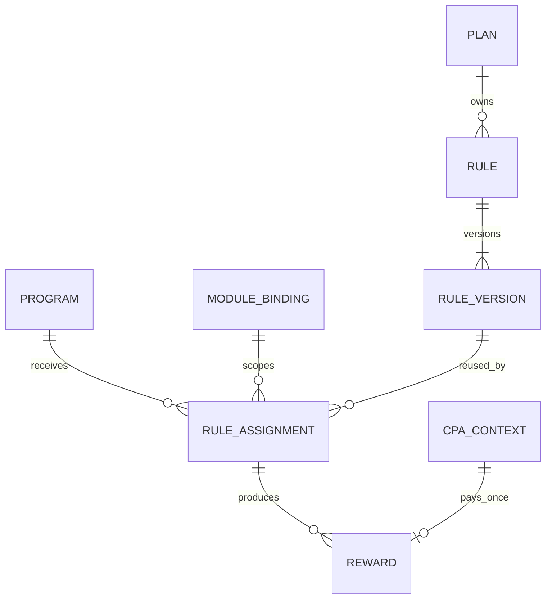

# Reglas y recompensas IB — BDS

- **Versión:** 0.2
- **Estado:** base inicial

**Propósito:** definir reglas reutilizables, su asignación contextual y la trazabilidad de las recompensas.

## Contexto

CPA, volumen, PnL y futuras modalidades utilizan un pipeline común de evaluación, auditoría y pago. Las diferencias se expresan mediante estrategias y configuraciones versionadas. Una regla puede compartirse entre varios programas del mismo plan sin duplicar su definición.

## Glosario

| Concepto | Definición |
| --- | --- |
| Regla | Política reutilizable que identifica una estrategia de recompensa. |
| Versión de regla | Configuración publicada e inmutable de una regla. |
| Asignación | Relación que establece en qué programa, módulo y scope aplica una versión de regla. |
| Estrategia | Tipo de cálculo que interpreta una configuración válida y produce una evaluación. |
| Recompensa | Obligación calculada a favor de un beneficiario. |
| Settlement | Confirmación de que la operación financiera solicitada fue asentada. |
| Contexto CPA | Snapshot que fija referido, plan, programa, regla y condiciones aplicables a una adquisición. |

## Relaciones



## Reglas de dominio

| ID | Regla |
| --- | --- |
| BR-RULE-001 | La identidad de una regla pertenece al plan y es independiente de un programa o módulo concreto. |
| BR-RULE-002 | Una versión de regla publicada es inmutable. Toda modificación crea una nueva versión. |
| BR-RULE-003 | Una misma versión puede asignarse a múltiples combinaciones de programa y módulo del mismo plan. |
| BR-RULE-004 | La asignación determina el programa, módulo, vigencia y scope de instrumentos donde aplica la versión. |
| BR-RULE-005 | Una regla no puede utilizar un módulo que el plan no tenga habilitado. |
| BR-RULE-006 | Un cambio de versión no altera recompensas ni contextos calculados con versiones anteriores. |
| BR-RULE-007 | La configuración de una versión debe ser válida para el tipo de estrategia declarado antes de publicarse. |
| BR-REWARD-001 | CPA, volumen y PnL comparten la orquestación de contexto, elegibilidad, idempotencia, auditoría y solicitud de pago. |
| BR-REWARD-002 | Cada estrategia declara los hechos o métricas que necesita; compartir pipeline no obliga a compartir el mismo input. |
| BR-REWARD-003 | Una recompensa conserva plan, programa, módulo, asignación, versión de regla, inputs y resultado utilizados. |
| BR-REWARD-004 | La creación de una recompensa es idempotente respecto a su fuente, beneficiario, regla y dimensión de distribución. |
| BR-REWARD-005 | IB es fuente de verdad de por qué existe una recompensa; el dominio financiero es fuente de verdad de si el dinero fue asentado. |
| BR-REWARD-006 | Un control operativo puede pausar cálculo o settlement sin modificar las reglas y snapshots publicados. |
| BR-REWARD-007 | Pausar un módulo o capacidad no revierte automáticamente recompensas ya calculadas ni settlements confirmados. |
| BR-INSTRUMENT-001 | Un instrumento se referencia mediante un binding perteneciente al módulo que origina la actividad. |
| BR-INSTRUMENT-002 | El mismo instrumento comercial puede habilitarse para unos módulos y excluirse de otros. |
| BR-INSTRUMENT-003 | Los identificadores locales de IB no tienen que coincidir con los identificadores del módulo proveedor. |
| BR-CPA-001 | Al capturar una adquisición CPA se fija el usuario referido y el contexto vigente que determina por qué programa se pagará. |
| BR-CPA-002 | La progresión posterior del IB no cambia el programa, regla, scope o condiciones congeladas en el contexto CPA. |
| BR-CPA-003 | Una misma adquisición no puede pagarse nuevamente por el solo hecho de que el IB cambie de programa. |

## Ejemplo de reutilización CPA

```text
Plan Fx - Advanced
└── Regla CPA Standard v1
    ├── Programa Basic    + Broker
    ├── Programa Advanced + Broker
    └── Programa Pro      + Broker
```

Las tres asignaciones comparten configuración económica. Cada una puede utilizar un scope de instrumentos explícito. Si cambian monto o umbrales, se publica otra versión y las asignaciones se actualizan deliberadamente.

## Eventos de negocio

- Versión de regla publicada.
- Regla asignada o retirada de un programa y módulo.
- Contexto CPA capturado.
- Actividad aceptada para evaluación.
- Recompensa calculada.
- Pago solicitado.
- Pago confirmado, fallido o revertido.

## Decisiones pendientes

- Estados y transiciones definitivos de una recompensa.
- Política de reintentos, reversas y compensaciones financieras.
- Prioridad cuando múltiples reglas coinciden con la misma actividad.
- Si una actividad puede producir varias recompensas válidas dentro del mismo plan.
- Capacidades mínimas que cada estrategia exige a los módulos proveedores.
- Fórmulas definitivas de CPA, volumen, PnL y distribución multinivel.
