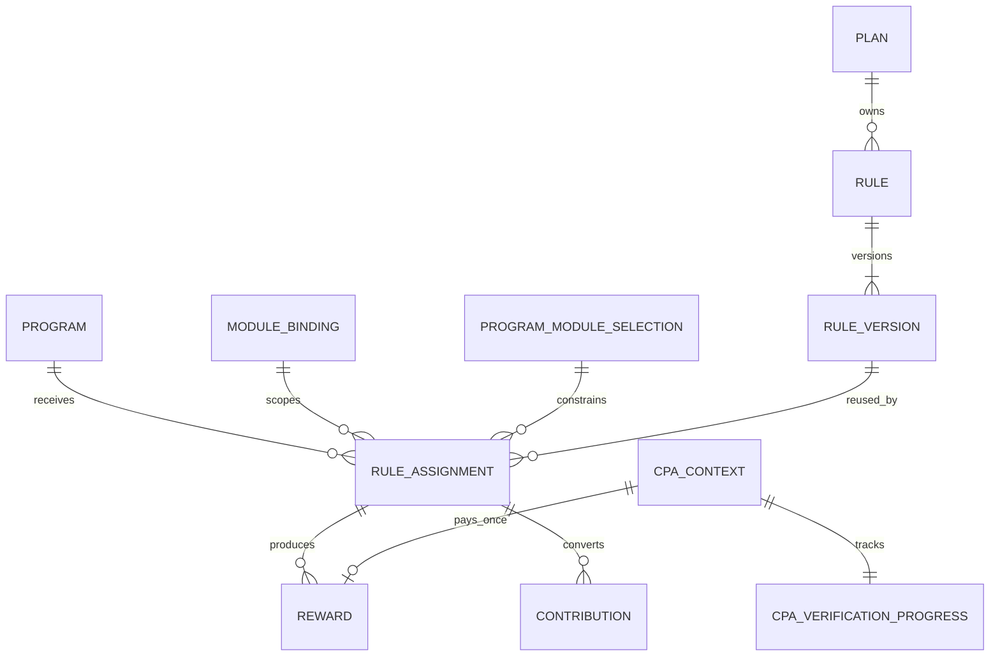

# Reglas y recompensas IB — BDS

- **Versión:** 2.2
- **Estado:** vigente; garantías comunes de recompensa y responsabilidades de evidencia confirmadas

**Propósito:** definir reglas reutilizables, su asignación contextual y la trazabilidad de las recompensas.

## Contexto

CPA, volumen, PnL y puntos de progresión conservan sus causas y formas de
evaluación propias. Comparten garantías de elegibilidad, identidad económica,
trazabilidad y conservación de la configuración aplicada. Una regla puede
compartirse entre varios programas del mismo plan sin duplicar su definición.

El catálogo de reglas —identidad, versiones publicadas e inmutables y asignaciones históricas— es único para Progression y Rewards. Progression consume estrategias de contribución; Rewards consume estrategias económicas. Ambos conservan la versión aplicada en sus resultados.

## Glosario

| Concepto | Definición |
| --- | --- |
| Regla | Política reutilizable que identifica una estrategia. Tiene un nombre único dentro del plan y un slug estable derivado de su nombre inicial. Puede destinarse a progresión o a recompensa según su tipo de estrategia. |
| Versión de regla | Configuración publicada e inmutable de una regla. |
| Asignación | Relación histórica que establece en qué programa, módulo, vigencia y scope aplica una versión de regla. |
| Asignación activa | Asignación cuyo intervalo de vigencia está abierto (`ends_at` nulo). |
| Scope de instrumentos | Alcance de instrumentos en el que aplica la asignación. En esta fase el único valor admitido es `all` (todos los instrumentos del módulo). |
| Estrategia | Tipo de cálculo que interpreta una configuración válida y produce una evaluación. |
| Recompensa | Obligación calculada a favor de un beneficiario, registrada en el ledger propio de IB con su causa, snapshot y estado. |
| Ledger de recompensas | Registro autoritativo de IB para las obligaciones de recompensa. Conserva su causa y snapshot; su estado refleja el ciclo informado por Finance. |
| Settlement | Confirmación de que la operación financiera solicitada fue asentada. |
| Contexto CPA | Snapshot que fija referido, plan, programa, asignación, versión de regla, scope y condiciones aplicables a una adquisición. |
| Progreso de verificación CPA | Estado observable y único de los requisitos de un contexto CPA. No es un historial de intentos ni una recompensa. |
| Evidencia CPA | Hechos verificables de actividad o depósito que una estrategia usa para evaluar un contexto CPA; no incluye una decisión de elegibilidad. |
| Run de Reward | Ejecución durable que congela el corte, configuración y red aplicables antes de calcular Rewards. No es un historial de intentos financieros. |
| Reward de volumen | Obligación originada por una posición cerrada elegible y distribuida a la red configurada. |
| PnL neto del período | Suma firmada del profit de las posiciones cerradas de una cuenta durante el período; incluye ganancias y pérdidas, sin swap ni comisiones. |
| Total PnL de nivel y moneda | Suma firmada de las cuentas elegibles de los referidos de un mismo nivel y moneda en un período de la suscripción beneficiaria. |
| Cursor PnL | Límite temporal aceptado desde el que comienza el siguiente intervalo del contexto de una suscripción beneficiaria y módulo. |
| Cierre PnL pendiente | Obligación de evaluar el tramo final de la suscripción anterior al cambiar de plan, aun después de su terminación. |

## Relaciones


```mermaid
erDiagram
    PLAN ||--o{ RULE : owns
    RULE ||--|{ RULE_VERSION : versions
    PROGRAM ||--o{ RULE_ASSIGNMENT : receives
    MODULE_BINDING ||--o{ RULE_ASSIGNMENT : scopes
    PROGRAM_MODULE_SELECTION ||--o{ RULE_ASSIGNMENT : constrains
    RULE_VERSION ||--o{ RULE_ASSIGNMENT : reused_by
    RULE_ASSIGNMENT ||--o{ REWARD : produces
    RULE_ASSIGNMENT ||--o{ CONTRIBUTION : converts
    CPA_CONTEXT ||--o| REWARD : pays_once
    CPA_CONTEXT ||--|| CPA_VERIFICATION_PROGRESS : tracks
```

## Reglas de dominio

| ID | Regla |
| --- | --- |
| BR-RULE-001 | La identidad de una regla pertenece al plan y es independiente de un programa o módulo concreto. |
| BR-RULE-002 | Una versión de regla publicada es inmutable. Toda modificación crea una nueva versión. |
| BR-RULE-003 | Una misma versión puede asignarse a múltiples combinaciones de programa y módulo del mismo plan. |
| BR-RULE-004 | La asignación determina el programa, módulo, vigencia y scope de instrumentos donde aplica la versión. |
| BR-RULE-005 | Una regla no puede utilizar un módulo que el plan no tenga habilitado. |
| BR-RULE-006 | Un cambio de versión no altera recompensas, contribuciones ni contextos calculados con versiones anteriores. |
| BR-RULE-007 | La configuración de una versión debe ser válida para el tipo de estrategia declarado antes de publicarse. |
| BR-RULE-008 | Toda regla tiene un nombre obligatorio y único dentro de su plan, una descripción opcional y un slug único derivado del nombre inicial. El slug permanece estable aunque cambie el nombre; una colisión de nombre o slug impide crear o renombrar la regla. |
| BR-RULE-009 | Publicar una versión no cambia automáticamente las asignaciones existentes. Cada asignación selecciona deliberadamente una versión publicada, y sustituirla por otra versión es una decisión explícita. |
| BR-RULE-010 | Una asignación solo puede referenciar un módulo habilitado por el plan y seleccionado por el programa receptor. |
| BR-RULE-011 | Una asignación selecciona una versión publicada de la misma regla. El identificador de versión de una asignación histórica no se modifica. |
| BR-RULE-012 | La vigencia de una asignación es el intervalo semiabierto `[starts_at, ends_at)`. Una asignación activa tiene `ends_at` nulo. Crear una asignación la activa de inmediato. Un reemplazo o retiro en el mismo instante puede dejar `ends_at = starts_at` (intervalo vacío). |
| BR-RULE-013 | En un instante dado existe como máximo una asignación activa por combinación de regla, programa y módulo. Distintas reglas pueden coexistir en el mismo programa y módulo cuando no violan BR-RULE-016. |
| BR-RULE-014 | Reemplazar la versión de una asignación cierra la vigente (`ends_at = ahora`) y crea otra activa con la nueva versión en la misma operación. Retirar solo cierra la vigente. |
| BR-RULE-015 | En esta fase el scope de una asignación es siempre `all`. Un scope instrumental explícito requiere el catálogo de instrumentos del módulo. |
| BR-RULE-016 | Para la estrategia `points_per_quantity_unit`, en un instante dado existe como máximo una asignación activa por combinación de programa, módulo y métrica o unidad. El mismo tipo puede repetirse en ese programa y módulo solo con métricas o unidades distintas. |
| BR-REWARD-001 | Toda Reward CPA, volumen o PnL exige contexto y elegibilidad verificables, una identidad económica que impida duplicados y evidencia auditable de su causa y resultado. |
| BR-REWARD-002 | Cada modalidad utiliza los hechos y métricas necesarios para su evaluación y conserva la configuración aplicada; compartir garantías no exige la misma secuencia de evaluación ni los mismos inputs. |
| BR-REWARD-003 | Una recompensa conserva plan, programa, versión de regla, inputs y resultado utilizados. Volumen y PnL conservan su módulo y asignación; CPA conserva su asociación al programa y todos los módulos participantes en su contexto y evidencia. |
| BR-REWARD-004 | La creación de una recompensa es idempotente respecto a su fuente, beneficiario, regla y dimensión de distribución. |
| BR-REWARD-005 | IB es fuente de verdad de por qué existe una recompensa; el dominio financiero es fuente de verdad de si el dinero fue asentado. |
| BR-REWARD-006 | El procesamiento pausado de un módulo detiene sus nuevos cálculos y pagos propios sin modificar reglas ni snapshots publicados. En CPA detiene nuevos aportes de volumen de ese módulo; los aportes confirmados y el pago de una obligación CPA ya calculada son independientes de su disponibilidad. |
| BR-REWARD-007 | Pausar o desactivar un módulo no revierte automáticamente recompensas ya calculadas ni settlements confirmados. |
| BR-REWARD-008 | Una recompensa CPA, volumen o PnL nace en estado `pending` y solo transiciona a `settled` cuando Finance confirma síncronamente una comisión `posted`, creada o recuperada por idempotencia. La causa y el snapshot no se sustituyen durante esa transición. |
| BR-REWARD-009 | Un fallo de integración o contrato de Finance deja la Reward en `failed`. `pending` y `failed` son reintentables; cada reintento usa la misma clave idempotente de settlement. |
| BR-REWARD-010 | IB conserva únicamente el resumen operativo del settlement: proveedor, referencia financiera, clave idempotente, contador, último intento, error sanitizado y fecha de settlement. Finance conserva el asiento financiero definitivo. |
| BR-REWARD-011 | El pago conserva beneficiario, modalidad, importe, moneda y precisión de la Reward. La habilitación de pagos PnL es independiente de su generación; deshabilitarla no cancela obligaciones ni impide recuperar el estado de pagos enviados anteriormente. |
| BR-REWARD-012 | Una Reward `pending` o `failed` solo puede cancelarse después de consultar Finance por su clave de settlement; si existe una comisión `posted` compatible, IB conserva o repara el estado `settled` y rechaza la cancelación. Si un pago previo permanece incierto, la ausencia temporal del evento no autoriza cancelar: se conserva la intención pendiente y se recupera el pago con su misma identidad. Sin intentos de pago ni trabajo concurrente, una ausencia válida permite cancelar. |
| BR-REWARD-013 | Una Reward `settled` puede revertirse una sola vez mediante un evento Finance `reversal` idempotente que referencia su comisión original. La reversa no borra ni reescribe el asiento inicial. |
| BR-REWARD-014 | Una compensación crea una nueva Reward independiente, enlazada a la reversada, con importe explícito positivo y la misma moneda y precisión congeladas. No reutiliza el contexto CPA ni modifica la Reward origen. |
| BR-REWARD-015 | La reconciliación recurrente consulta solo operaciones financieras inciertas o Rewards con hold; no reconsulta el historial confirmado por antigüedad. Una contradicción verificable activa un hold y solo una consulta posterior consistente puede retirarlo. |
| BR-REWARD-016 | Las Rewards de volumen y PnL resuelven la red multinivel al inicio de su run y conservan los beneficiarios y niveles resueltos. Un cambio posterior de red no reescribe una distribución iniciada. |
| BR-REWARD-017 | El procesamiento de la recompensa obtiene de Identity como máximo la profundidad mayor que pueda remunerar la configuración congelada. Si el proveedor no admite límite, IB descarta localmente los niveles no remunerables sin alterar el snapshot. |
| BR-REWARD-018 | La Reward de volumen es idempotente por posición fuente, beneficiario, nivel de distribución, asignación y versión de regla. Los modos `event`, `periodic` y `both` comparten esa misma identidad. |
| BR-REWARD-019 | La configuración de volumen pertenece al programa y tiene vigencia. Sus modos admisibles son `event`, `periodic` y `both`; cambiarla no modifica Rewards ya creadas. |
| BR-REWARD-020 | La moneda y precisión de una Reward de volumen proceden del `server_group` de la posición. No se infieren de ICU, Finance ni de una plantilla de pago. |
| BR-REWARD-021 | La base distribuible de volumen se obtiene de la posición: modalidad fija = `closed_volume × participation_rate`; modalidad porcentual = `broker_granted_commission × participation_rate`. La base se distribuye por nivel conforme a la plantilla congelada. Cada resultado aplica además `personal_rate` del beneficiario y, solo si es Master IB, su `master_rate`; los tres valores se congelan en la Reward. |
| BR-REWARD-021A | El modo predeterminado de una Reward de volumen es `periodic`. Los modos `event` y `both` usan el evento de Trading únicamente como disparador para consultar la posición autoritativa en Broker. Un `409 CLOSED_POSITION_NOT_READY`, timeout o 5xx no crea Reward y conserva una recepción reintentable con backoff. |
| BR-REWARD-022 | Una configuración PnL pertenece al programa y sus módulos, es histórica y declara una única cadencia común `daily`, `weekly`, `monthly` o `yearly`. Los períodos vencen en límites UTC: día, lunes semanal, primero de mes y primero de enero. La frecuencia del procesamiento no modifica esos límites ni fusiona períodos atrasados. |
| BR-REWARD-022A | Cada configuración PnL admite una sola selección por módulo Broker habilitado en el plan. La versión elegida debe estar publicada, ser de PnL, pertenecer al plan y tener una única asignación efectiva de esa versión al programa/módulo. La plantilla asociada a la regla pertenece al mismo plan y fija una tasa común por nivel. No se crean asignaciones implícitas ni se sustituye la versión seleccionada por otra vigente. |
| BR-REWARD-022B | Reemplazar la configuración completa conserva actor y revisiones con vigencias semiabiertas, fijadas al momento del cambio sin retroactividad. Un reemplazo idéntico conserva la revisión; retirar todos los módulos termina su vigencia. Las consultas históricas conservan asignación, regla, versión y plantilla con sus niveles y tasas originales. |
| BR-REWARD-023 | Broker es autoridad del resultado realizado de cada cuenta. El PnL del período suma exclusivamente profit de posiciones cerradas en el intervalo semiabierto solicitado. Incluye ambos signos sin swap, comisiones ni neutralización de cashflows. Ganancias y pérdidas se compensan por suscripción beneficiaria, módulo, período, nivel y moneda. Solo un total negativo puede originar una Reward; su base es el valor absoluto del total. El grupo de la cuenta no delimita la compensación. |
| BR-REWARD-024 | Una Reward PnL es idempotente por suscripción beneficiaria, módulo, período cerrado, nivel, moneda, asignación y versión de regla. Una cuenta individual no identifica la obligación agregada. |
| BR-REWARD-025 | IB conserva el intervalo, resultado firmado, cuenta, moneda, precisión e identidades de todas las posiciones utilizadas, incluidas las ganadoras, para cada cuenta contribuyente. Además conserva red, contexto, agregado firmado, tasas, factores, mínimo, redondeo y resultado. No copia posiciones completas ni delega elegibilidad, red, importe o settlement. |
| BR-REWARD-026 | CPA, volumen y PnL pueden acumularse con una configuración aplicable no ambigua por modalidad y contexto. |
| BR-REWARD-027 | Cambiar de programa o tasas dentro del mismo plan aplica a PnL el contexto del corte final al período completo. Cambiar de plan cierra el tramo de la suscripción anterior en su terminación, usando el contexto inmediatamente anterior; la nueva suscripción inicia su intervalo en ese límite. Las obligaciones ya generadas no se cancelan por terminar la suscripción. |
| BR-REWARD-028 | Cada consulta utiliza el cierre de las posiciones en [inicio, fin). Un cierre exactamente en el fin pertenece al siguiente período. IB congela el resultado y las identidades de las posiciones utilizadas antes de generar obligaciones. El tratamiento de posiciones incorporadas o corregidas después de evaluar el período permanece pendiente; no existe recálculo automático. |
| BR-REWARD-029 | Activación, cambio de cadencia y reanudación fijan un inicio temporal sin remunerar actividad anterior a ese inicio. Una cuenta nueva aporta todos sus cierres dentro del intervalo consultado; no establece baseline individual. Cambiar de grupo de cuenta no divide por sí solo la compensación. El importe PnL es `abs(total_pnl_nivel_moneda) × tasa_nivel × personal_rate × master_rate`, con el último factor solo para Master IB; aplica mínimo antes de un único redondeo half-up a la precisión de la moneda entregada por Broker. |
| BR-REWARD-030 | Los contextos PnL mantienen cursores temporales independientes por suscripción beneficiaria, módulo y cadencia. Todas las cuentas de la red congelada se evalúan en el intervalo del período con moneda y precisión explícitas. Los períodos vencidos se evalúan en orden; un fallo en un contexto no impide evaluar los demás. |
| BR-REWARD-031 | Un período PnL conserva red, contexto económico, tasas y mínimo antes de crear obligaciones. Solo una evidencia completa y válida permite avanzar el cursor temporal junto con el período recuperable. Un fallo posterior continúa las mismas entradas, incluidas las obligaciones creadas parcialmente, sin duplicarlas ni sustituirlas por valores actuales. |
| BR-REWARD-032 | Cambiar de plan conserva el cierre pendiente de la suscripción anterior junto con su terminación y la nueva suscripción; si el cambio no se confirma, tampoco existe ese cierre. Se evalúan primero los períodos anteriores y luego el tramo final; si termina en un límite de cadencia, existe un único período y ningún tramo vacío. |
| BR-REWARD-033 | Los totales de nivel y moneda cero o positivos y los importes descartados por mínimo o redondeo conservan un resultado auditable sin Reward. La evidencia ausente o inválida conserva el período pendiente y no avanza el cursor temporal. |
| BR-REWARD-034 | La red PnL se conserva tal como fue obtenida al iniciar el período; no representa una reconstrucción histórica de la red. Una pausa conserva las entradas ya congeladas y difiere su evaluación; la reanudación no convierte actividad previa no congelada en remunerable. |
| BR-REWARD-035 | Antes de crear la primera obligación de una posición, volumen conserva su actividad, distribución y todas las entradas económicas aplicables al canal de procesamiento. Los reintentos reutilizan esas entradas y conservan los resultados parciales; evento y barrido mantienen la misma identidad económica aunque su elegibilidad difiera. |
| BR-REWARD-036 | Pago, cancelación, reversa, compensación y recuperación coordinan el trabajo sobre la misma Reward. Una autorización de trabajo vencida no permite confirmar resultados. Las solicitudes financieras conservan identidad e importe antes de su envío; un reintento no los reemplaza por datos actuales. La compensación y su vínculo al origen son indivisibles. |
| BR-REWARD-037 | El cliente consulta únicamente sus Rewards y su estado económico, sin evidencia ni datos administrativos de otros beneficiarios. Administración requiere la capacidad de gestión de Rewards para consultar evidencia y procesamiento PnL; expone solo la información necesaria para auditoría, excluyendo credenciales y autorizaciones internas de trabajo. |
| BR-REWARD-038 | Se adopta conscientemente una única precisión por moneda en las cuentas suministradas por Broker: no se contempla USD/3 coexistiendo con USD/2. Una contradicción hace inválida la evidencia del período; no crea una agrupación adicional ni autoriza redondeo o conversión implícitos. Monedas distintas se evalúan separadamente. |
| BR-INSTRUMENT-001 | Un instrumento se referencia mediante un binding perteneciente al módulo que origina la actividad. |
| BR-INSTRUMENT-002 | El mismo instrumento comercial puede habilitarse para unos módulos y excluirse de otros. |
| BR-INSTRUMENT-003 | Los identificadores locales de IB no tienen que coincidir con los identificadores del módulo proveedor. |
| BR-CPA-001 | Al recibir una adquisición CPA se fija el usuario referido, el IB beneficiario y el plan y programa de la suscripción del IB en ese instante, incluida la asociación CPA y versión de regla. El contexto se captura al recibir el hecho; no se presupone un instante de ocurrencia aportado por el productor. |
| BR-CPA-002 | La progresión posterior del IB y la publicación de nuevas versiones no cambian el programa, asignación, versión de regla, scope o condiciones congeladas en el contexto CPA. |
| BR-CPA-003 | Una misma adquisición no puede pagarse nuevamente por el solo hecho de que el IB cambie de programa. |
| BR-CPA-004 | La captura CPA es idempotente por el par usuario referido e IB. Las redeliveries del mismo hecho no crean otro contexto ni otra recompensa. |
| BR-CPA-005 | El contexto CPA congela todos los módulos configurados y el conjunto de símbolos y grupos elegibles al capturar. La pausa o inactividad no impide capturar el contexto. Cambios y retiros posteriores no alteran el alcance congelado. |
| BR-CPA-006 | Un programa puede tener como máximo una asociación CPA activa a una versión publicada de regla `cpa_fixed_amount`. |
| BR-CPA-007 | La adquisición exige dos umbrales positivos independientes: puntos de volumen y puntos de depósito. Ambos deben alcanzarse; el exceso en una dimensión nunca compensa la falta de la otra. |
| BR-CPA-008 | Los depósitos certificados de Finance se miden desde la captura en una única moneda y precisión configuradas, independientes de la moneda del pago. Una tasa común convierte cada unidad monetaria mayor a puntos de depósito; no existe conversión de moneda ni atribución del mismo depósito a varios módulos. |
| BR-CPA-009 | Cada módulo configura una tasa positiva de puntos por lote. Solo su volumen cerrado desde la captura, dentro del snapshot de símbolos y grupos, aporta puntos de volumen. Se conservan cantidades reales y unidades. |
| BR-CPA-010 | Los puntos CPA pertenecen a la adquisición y son independientes de Progression: no mueven placement, no consumen sus puntos ni aplican sus ponderaciones, ventanas o profundidad de red. |
| BR-CPA-011 | Un contexto CPA tiene un único progreso observable: pending, qualified, error o expired. Un fallo técnico por fuente conserva sus aportes y no bloquea las restantes. Si los dos umbrales se cumplen con aportes verificados y el contexto no ha expirado, el contexto califica aunque alguna fuente no esté disponible. Un contexto `expired` es terminal y no puede originar una Reward. |
| BR-CPA-012 | Cada fuente conserva su último corte confirmado y su estado. Solo una consulta completa y persistida permite avanzar ese corte. La verificación conserva todas las entradas nuevas aceptadas, sin exigir un snapshot del total por ejecución. |
| BR-CPA-013 | Cuando todos los requisitos acumulativos se satisfacen, el contexto puede originar una única recompensa `pending`; la relación a esa recompensa pertenece al contexto CPA, no al progreso de verificación. |
| BR-CPA-014 | El proveedor de actividad entrega evidencia normalizada y Finance certifica depósitos; ninguno decide elegibilidad CPA, importe, beneficiario, recompensa ni settlement. |
| BR-CPA-015 | La versión CPA declara moneda y precisión explícitas e independientes para pago y depósito; IB no las infiere de fuentes externas. Tasas, umbrales y cantidades de volumen admiten hasta ocho decimales; los productos y sumas de puntos mantienen exactitud hasta dieciséis sin redondeo. |
| BR-CPA-016 | Cada contribución CPA conserva proveedor, identidad fuente, módulo cuando corresponde, cantidad real, unidad o moneda, tasa congelada, puntos calculados, ocurrencia y corte verificado. Se conserva desde su aceptación, aun antes de calificar. La Reward conserva la evidencia que justificó su nacimiento. |
| BR-CPA-017 | Los proveedores garantizan que no corregirán, retirarán ni publicarán hechos anteriores a un corte confirmado. La consulta continúa desde el último corte por fuente. Una contradicción se trata como error de contrato y no reescribe silenciosamente aportes verificados. |
| BR-CPA-018 | El ledger `rewards` es genérico. La relación específica de CPA se conserva de forma inversa, única e inmutable mediante `cpa_context.reward_id`; una Reward no exige ni contiene un contexto CPA. |
| BR-CPA-019 | La lectura cliente del progreso CPA queda limitada al IB propietario del contexto. La lectura administrativa requiere la capacidad de gestión de Rewards y puede exponer únicamente los identificadores y errores sanitizados necesarios para auditoría. |

| BR-CPA-020 | La contribución de volumen es única por adquisición, módulo, proveedor e identidad fuente. Una misma operación puede contribuir una vez por cada módulo configurado que la entregue. El depósito es único por adquisición, proveedor e identidad Finance. |

| BR-CPA-021 | Pausar, desactivar o perder una fuente conserva todos sus aportes confirmados y su corte. Las restantes fuentes pueden completar el CPA usando esos aportes. Al reanudar se consulta desde el último corte confirmado. El volumen nuevo de un módulo pausado o inactivo no se convierte mientras dure esa condición. |

| BR-CPA-022 | Los puntos se calculan al aceptar el hecho y se conservan con su tasa congelada. Los totales se reconstruyen sumando los puntos persistidos; no se revaloran por cambios posteriores de política o programa. |

| BR-CPA-023 | La asociación CPA pertenece al programa y tiene vigencia histórica. Seleccionar la misma versión conserva la asociación activa; reemplazar o retirar cierra la vigente sin alterar contextos anteriores. No requiere una asignación CPA a un módulo único. |

| BR-CPA-024 | Una obligación CPA ya calculada se paga independientemente de la pausa o inactividad de módulos participantes, respetando los controles del plan y financieros aplicables. |

| BR-CPA-025 | La versión CPA declara un plazo de espera `expiration_days` entero de al menos un día. El contexto congela ese umbral al capturar. La vigencia se mide en días de calendario desde la captura; si los días transcurridos superan el umbral, el contexto expira con razón estable `waiting_period_exceeded` y no puede calificar. Si en la misma evaluación se cumplen umbrales de puntos y el plazo ya se superó, prevalece la expiración. |

## Cálculo CPA por puntos

Para cada adquisición:

- Puntos de volumen = suma de lotes elegibles de cada módulo × tasa congelada de ese módulo.
- Puntos de depósito = suma de depósitos certificados en unidades monetarias mayores × tasa común congelada.
- Califica cuando puntos de volumen ≥ umbral de volumen Y puntos de depósito ≥ umbral de depósito y el contexto no ha expirado.

Los acumulados no vencen ni se reinician por ventanas de Progression; ello no anula el plazo de espera de la adquisición.
Un corte describe la fuente consultada, no un historial obligatorio de snapshots por run.
Una respuesta satisfactoria sin hechos confirma el intervalo vacío.
Una evidencia inválida o una contradicción conocida del contrato impide calificar hasta su resolución.

## Ejemplo de reutilización CPA

```text
Plan Fx - Advanced
└── Regla CPA Standard v1
    ├── Programa Basic
    ├── Programa Advanced
    └── Programa Pro
```

Las tres asociaciones comparten importe, umbrales de puntos y conversiones por módulo. Si cambian monto o umbrales, se publica otra versión y las asignaciones se reemplazan deliberadamente, conservando el historial.

## Eventos de negocio

- Versión de regla publicada.
- Regla asignada o retirada de un programa y módulo.
- Versión de una asignación reemplazada.
- Contexto CPA capturado.
- Progreso CPA actualizado.
- Contexto CPA calificado.
- Contexto CPA expirado.
- Actividad aceptada para evaluación.
- Recompensa calculada.
- Pago solicitado.
- Reward asentada.
- Reward cancelada, revertida o compensada.
- Discrepancia financiera detectada o resuelta.
- Run de Reward iniciado o cerrado.
- Reward de volumen calculada.
- Período PnL evaluado.
- Cierre PnL pendiente registrado o completado.

## Estados de evaluación PnL

Un período pasa de pendiente de evidencia a listo para cálculo cuando todos sus
cortes válidos quedan conservados. Al terminar la evaluación pasa a evaluado,
con Rewards `pending` o resultados auditables sin Reward. Un fallo conserva el
estado alcanzado y sus entradas; recuperar un período tiene prioridad sobre
abrir el siguiente en el mismo contexto. Evaluar el período no confirma un pago.

## Vinculación de plantillas de pago

La selección de plantillas de pago consume una vinculación permanente de la
familia de pago perteneciente al mismo plan (BR-TEMPLATE-001–006 del BDS de
planes). Publicar o vincular otra versión no sustituye selecciones económicas,
asignaciones ni snapshots históricos. La vinculación no genera obligaciones.

## Decisiones pendientes

- Prioridad cuando múltiples reglas de recompensa coinciden con la misma actividad.
- Si una actividad puede producir varias recompensas válidas dentro del mismo plan.
- Confirmación futura de Trading Account Service como emisor posterior a la persistencia para eliminar la carrera conocida del modo `event`; `event` y `both` ya están autorizados mediante receipts recuperables.
- Validación S2S reproducible del contrato de profit realizado e identidades de posiciones publicado por Broker.
- Tratamiento económico de posiciones incorporadas o corregidas después de completar un período.
- Forma del scope instrumental explícito cuando exista el catálogo de instrumentos.
