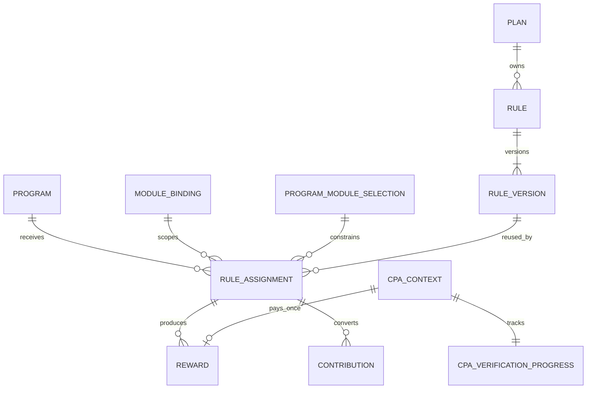

# Reglas y recompensas IB — BDS

- **Versión:** 1.6
- **Estado:** vigente; garantías comunes de recompensa y responsabilidades de evidencia confirmadas

**Propósito:** definir reglas reutilizables, su asignación contextual y la trazabilidad de las recompensas.

## Contexto

CPA, volumen, PnL y puntos de progresión conservan sus causas y formas de
evaluación propias. Comparten garantías de elegibilidad, identidad económica,
trazabilidad y conservación de la configuración aplicada. Una regla puede
compartirse entre varios programas del mismo plan sin duplicar su definición.

El catálogo de reglas —identidad, versiones publicadas e inmutables y asignaciones históricas— es único para Progression y Rewards. Progression consume estrategias de contribución; Rewards consume estrategias económicas. Ambos conservan la versión aplicada en sus resultados.

## Glosario

| Concepto | Definición |
| --- | --- |
| Regla | Política reutilizable que identifica una estrategia. Tiene un nombre único dentro del plan y un slug estable derivado de su nombre inicial. Puede destinarse a progresión o a recompensa según su tipo de estrategia. |
| Versión de regla | Configuración publicada e inmutable de una regla. |
| Asignación | Relación histórica que establece en qué programa, módulo, vigencia y scope aplica una versión de regla. |
| Asignación activa | Asignación cuyo intervalo de vigencia está abierto (`ends_at` nulo). |
| Scope de instrumentos | Alcance de instrumentos en el que aplica la asignación. En esta fase el único valor admitido es `all` (todos los instrumentos del módulo). |
| Estrategia | Tipo de cálculo que interpreta una configuración válida y produce una evaluación. |
| Recompensa | Obligación calculada a favor de un beneficiario, registrada en el ledger propio de IB con su causa, snapshot y estado. |
| Ledger de recompensas | Registro autoritativo de IB para las obligaciones de recompensa. Conserva su causa y snapshot; su estado refleja el ciclo informado por Finance. |
| Settlement | Confirmación de que la operación financiera solicitada fue asentada. |
| Contexto CPA | Snapshot que fija referido, plan, programa, asignación, versión de regla, scope y condiciones aplicables a una adquisición. |
| Progreso de verificación CPA | Estado observable y único de los requisitos de un contexto CPA. No es un historial de intentos ni una recompensa. |
| Evidencia CPA | Hechos verificables de actividad o depósito que una estrategia usa para evaluar un contexto CPA; no incluye una decisión de elegibilidad. |
| Run de Reward | Ejecución durable que congela el corte, configuración y red aplicables antes de calcular Rewards. No es un historial de intentos financieros. |
| Reward de volumen | Obligación originada por una posición cerrada elegible y distribuida a la red configurada. |
| PnL neto del período | Variación de balance de una cuenta de trading, menos sus depósitos netos de retiros asentados durante el mismo período. |

## Relaciones


```mermaid
erDiagram
    PLAN ||--o{ RULE : owns
    RULE ||--|{ RULE_VERSION : versions
    PROGRAM ||--o{ RULE_ASSIGNMENT : receives
    MODULE_BINDING ||--o{ RULE_ASSIGNMENT : scopes
    PROGRAM_MODULE_SELECTION ||--o{ RULE_ASSIGNMENT : constrains
    RULE_VERSION ||--o{ RULE_ASSIGNMENT : reused_by
    RULE_ASSIGNMENT ||--o{ REWARD : produces
    RULE_ASSIGNMENT ||--o{ CONTRIBUTION : converts
    CPA_CONTEXT ||--o| REWARD : pays_once
    CPA_CONTEXT ||--|| CPA_VERIFICATION_PROGRESS : tracks
```

## Reglas de dominio

| ID | Regla |
| --- | --- |
| BR-RULE-001 | La identidad de una regla pertenece al plan y es independiente de un programa o módulo concreto. |
| BR-RULE-002 | Una versión de regla publicada es inmutable. Toda modificación crea una nueva versión. |
| BR-RULE-003 | Una misma versión puede asignarse a múltiples combinaciones de programa y módulo del mismo plan. |
| BR-RULE-004 | La asignación determina el programa, módulo, vigencia y scope de instrumentos donde aplica la versión. |
| BR-RULE-005 | Una regla no puede utilizar un módulo que el plan no tenga habilitado. |
| BR-RULE-006 | Un cambio de versión no altera recompensas, contribuciones ni contextos calculados con versiones anteriores. |
| BR-RULE-007 | La configuración de una versión debe ser válida para el tipo de estrategia declarado antes de publicarse. |
| BR-RULE-008 | Toda regla tiene un nombre obligatorio y único dentro de su plan, una descripción opcional y un slug único derivado del nombre inicial. El slug permanece estable aunque cambie el nombre; una colisión de nombre o slug impide crear o renombrar la regla. |
| BR-RULE-009 | Publicar una versión no cambia automáticamente las asignaciones existentes. Cada asignación selecciona deliberadamente una versión publicada, y sustituirla por otra versión es una decisión explícita. |
| BR-RULE-010 | Una asignación solo puede referenciar un módulo habilitado por el plan y seleccionado por el programa receptor. |
| BR-RULE-011 | Una asignación selecciona una versión publicada de la misma regla. El identificador de versión de una asignación histórica no se modifica. |
| BR-RULE-012 | La vigencia de una asignación es el intervalo semiabierto `[starts_at, ends_at)`. Una asignación activa tiene `ends_at` nulo. Crear una asignación la activa de inmediato. Un reemplazo o retiro en el mismo instante puede dejar `ends_at = starts_at` (intervalo vacío). |
| BR-RULE-013 | En un instante dado existe como máximo una asignación activa por combinación de regla, programa y módulo. Distintas reglas pueden coexistir en el mismo programa y módulo cuando no violan BR-RULE-016. |
| BR-RULE-014 | Reemplazar la versión de una asignación cierra la vigente (`ends_at = ahora`) y crea otra activa con la nueva versión en la misma operación. Retirar solo cierra la vigente. |
| BR-RULE-015 | En esta fase el scope de una asignación es siempre `all`. Un scope instrumental explícito requiere el catálogo de instrumentos del módulo. |
| BR-RULE-016 | Para la estrategia `points_per_quantity_unit`, en un instante dado existe como máximo una asignación activa por combinación de programa, módulo y métrica o unidad. El mismo tipo puede repetirse en ese programa y módulo solo con métricas o unidades distintas. |
| BR-REWARD-001 | Toda Reward CPA, volumen o PnL exige contexto y elegibilidad verificables, una identidad económica que impida duplicados y evidencia auditable de su causa y resultado. |
| BR-REWARD-002 | Cada modalidad utiliza los hechos y métricas necesarios para su evaluación y conserva la configuración aplicada; compartir garantías no exige la misma secuencia de evaluación ni los mismos inputs. |
| BR-REWARD-003 | Una recompensa conserva plan, programa, módulo, asignación, versión de regla, inputs y resultado utilizados. |
| BR-REWARD-004 | La creación de una recompensa es idempotente respecto a su fuente, beneficiario, regla y dimensión de distribución. |
| BR-REWARD-005 | IB es fuente de verdad de por qué existe una recompensa; el dominio financiero es fuente de verdad de si el dinero fue asentado. |
| BR-REWARD-006 | El procesamiento pausado de un módulo detiene sus nuevos cálculos y pagos sin modificar reglas ni snapshots publicados. |
| BR-REWARD-007 | Pausar o desactivar un módulo no revierte automáticamente recompensas ya calculadas ni settlements confirmados. |
| BR-REWARD-008 | Una recompensa CPA nace en estado `pending` y solo transiciona a `settled` cuando Finance confirma síncronamente una comisión `posted`, creada o recuperada por idempotencia. La causa y el snapshot no se sustituyen durante esa transición. |
| BR-REWARD-009 | Un fallo de integración o contrato de Finance deja la Reward en `failed`. `pending` y `failed` son reintentables; cada reintento usa la misma clave idempotente de settlement. |
| BR-REWARD-010 | IB conserva únicamente el resumen operativo del settlement: proveedor, referencia financiera, clave idempotente, contador, último intento, error sanitizado y fecha de settlement. Finance conserva el asiento financiero definitivo. |
| BR-REWARD-011 | RWD3.1 asienta solo Rewards CPA mediante `commission_type = cpa`, a favor del beneficiario de la Reward y en la wallet Finance derivada como `lowercase(currency_code) + '-main'`. |
| BR-REWARD-012 | Una Reward `pending` o `failed` solo puede cancelarse después de consultar Finance por su clave de settlement; si existe una comisión `posted` compatible, IB conserva o repara el estado `settled` y rechaza la cancelación. |
| BR-REWARD-013 | Una Reward `settled` puede revertirse una sola vez mediante un evento Finance `reversal` idempotente que referencia su comisión original. La reversa no borra ni reescribe el asiento inicial. |
| BR-REWARD-014 | Una compensación crea una nueva Reward independiente, enlazada a la reversada, con importe explícito positivo y la misma moneda y precisión congeladas. No reutiliza el contexto CPA ni modifica la Reward origen. |
| BR-REWARD-015 | La reconciliación recurrente consulta solo operaciones financieras inciertas o Rewards con hold; no reconsulta el historial confirmado por antigüedad. Una contradicción verificable activa un hold y solo una consulta posterior consistente puede retirarlo. |
| BR-REWARD-016 | Las Rewards de volumen y PnL resuelven la red multinivel al inicio de su run y conservan los beneficiarios y niveles resueltos. Un cambio posterior de red no reescribe una distribución iniciada. |
| BR-REWARD-017 | El procesamiento de la recompensa obtiene de Identity como máximo la profundidad mayor que pueda remunerar la configuración congelada. Si el proveedor no admite límite, IB descarta localmente los niveles no remunerables sin alterar el snapshot. |
| BR-REWARD-018 | La Reward de volumen es idempotente por posición fuente, beneficiario, nivel de distribución, asignación y versión de regla. Los modos `event`, `periodic` y `both` comparten esa misma identidad. |
| BR-REWARD-019 | La configuración de volumen pertenece al programa y tiene vigencia. Sus modos admisibles son `event`, `periodic` y `both`; cambiarla no modifica Rewards ya creadas. |
| BR-REWARD-020 | La moneda y precisión de una Reward de volumen proceden del `server_group` de la posición. No se infieren de ICU, Finance ni de una plantilla de pago. |
| BR-REWARD-021 | La base distribuible de volumen se obtiene de la posición: modalidad fija = `closed_volume × participation_rate`; modalidad porcentual = `broker_granted_commission × participation_rate`. La base se distribuye por nivel conforme a la plantilla congelada. Cada resultado aplica además `personal_rate` del beneficiario y, solo si es Master IB, su `master_rate`; los tres valores se congelan en la Reward. |
| BR-REWARD-021A | El modo predeterminado de una Reward de volumen es `periodic`. Los modos `event` y `both` usan el evento de Trading únicamente como disparador para consultar la posición autoritativa en Broker. Un `409 CLOSED_POSITION_NOT_READY`, timeout o 5xx no crea Reward y conserva una recepción reintentable con backoff. |
| BR-REWARD-022 | Una configuración PnL pertenece al programa y sus grupos de cuentas, es histórica y declara una única cadencia común `daily`, `weekly`, `monthly` o `yearly`. Los períodos vencen en límites UTC: día, lunes semanal, primero de mes y primero de enero. La frecuencia del procesamiento no modifica esos límites ni fusiona períodos atrasados. |
| BR-REWARD-022A | Cada configuración PnL admite una sola selección por módulo Broker habilitado en el plan y grupo. La versión elegida debe estar publicada, ser de PnL, pertenecer al plan y tener una única asignación efectiva de esa versión al programa/módulo. La plantilla vinculada pertenece al mismo plan. No se crean asignaciones implícitas ni se sustituye la versión seleccionada por otra vigente. |
| BR-REWARD-022B | Reemplazar la configuración completa conserva actor y revisiones con vigencias semiabiertas, fijadas al momento del cambio sin retroactividad. Un reemplazo idéntico conserva la revisión; retirar todos los grupos termina su vigencia. Las consultas históricas conservan asignación, regla, versión y plantilla con sus niveles y tasas originales. |
| BR-REWARD-023 | Broker es autoridad del balance y flujo de caja de la cuenta. Para un período sucesivo, `pnl_neto = balance_final - balance_inicial - (depósitos_asentados - retiros_asentados)`. El primer corte de cada cuenta establece únicamente la baseline y no calcula ni remunera historia anterior. Solo `pnl_neto < 0` puede originar Rewards PnL; su base es el valor absoluto del resultado firmado. |
| BR-REWARD-024 | Una Reward PnL es idempotente por cuenta, período cerrado, beneficiario, nivel, asignación y versión de regla. |
| BR-REWARD-025 | Las evidencias conservan referencias de los proveedores que justifican una Reward. Para PnL, IB conserva el snapshot de balance, totales y referencias opacas entregados por Broker; no copia movimientos completos ni delega la elegibilidad, la red, el importe de Reward o settlement. |
| BR-REWARD-026 | CPA, volumen y PnL pueden acumularse con una configuración aplicable no ambigua por modalidad y contexto. |
| BR-REWARD-027 | Cambiar de programa o tasas dentro del mismo plan aplica a PnL el contexto del corte final al período completo. Cambiar de plan cierra el tramo de la suscripción anterior en su terminación, usando el contexto inmediatamente anterior; la nueva suscripción inicia una baseline en ese límite. Las obligaciones ya generadas no se cancelan por terminar la suscripción. |
| BR-REWARD-028 | Un corte histórico usa la última observación de balance anterior o igual al instante solicitado y considera ese balance válido hasta dicho instante. El cashflow abarca el intervalo semiabierto entre cortes solicitados. Se conservan por separado fecha solicitada y fecha observada. Se acepta el riesgo conocido de PnL artificial cuando un movimiento todavía no está reflejado en la observación; ese desfase no introduce detección, gracia ni bloqueo automático. La ausencia de una observación sí impide avanzar baseline o generar Reward. |
| BR-REWARD-029 | Incorporación, cambio de cadencia, moneda o grupo y reanudación establecen baseline nueva sin remunerar actividad previa. El importe PnL es `abs(pnl_neto) × tasa_nivel × personal_rate × master_rate`, con el último factor solo para Master IB; aplica mínimo antes de un único redondeo half-up a precisión del grupo. |
| BR-INSTRUMENT-001 | Un instrumento se referencia mediante un binding perteneciente al módulo que origina la actividad. |
| BR-INSTRUMENT-002 | El mismo instrumento comercial puede habilitarse para unos módulos y excluirse de otros. |
| BR-INSTRUMENT-003 | Los identificadores locales de IB no tienen que coincidir con los identificadores del módulo proveedor. |
| BR-CPA-001 | Al recibir una adquisición CPA se fija el usuario referido, el IB y el contexto vigente que determina por qué programa se pagará, incluida la asignación y la versión de regla aplicable. El contexto se captura al recibir el hecho; no se presupone un instante de ocurrencia aportado por el productor. |
| BR-CPA-002 | La progresión posterior del IB y la publicación de nuevas versiones no cambian el programa, asignación, versión de regla, scope o condiciones congeladas en el contexto CPA. |
| BR-CPA-003 | Una misma adquisición no puede pagarse nuevamente por el solo hecho de que el IB cambie de programa. |
| BR-CPA-004 | La captura CPA es idempotente por el par usuario referido e IB. Las redeliveries del mismo hecho no crean otro contexto ni otra recompensa. |
| BR-CPA-005 | El contexto CPA conserva el conjunto de símbolos marcados para CPA del programa en el instante de captura. Cambios posteriores de programa, regla o símbolos no modifican ese snapshot. |
| BR-CPA-006 | Un programa puede tener como máximo una asociación CPA activa a una versión publicada de regla `cpa_fixed_amount`. |
| BR-CPA-007 | Los requisitos CPA configurados se cumplen de forma acumulativa: todos deben satisfacerse para que la estrategia pueda evaluar una adquisición. |
| BR-CPA-008 | Cuando un requisito CPA exige depósito certificado, este se mide desde la captura CPA y en la misma moneda configurada, sin conversión de moneda. |
| BR-CPA-009 | Cuando un requisito CPA exige volumen cerrado, se mide desde la captura CPA y solo para el snapshot de símbolos y grupos configurado al capturarla. |
| BR-CPA-010 | La verificación CPA es independiente de Progression: no mueve placements, no consume puntos y no aplica ponderaciones ni profundidad de red. |
| BR-CPA-011 | Un contexto CPA tiene un único progreso de verificación observable. Sus estados son `pending`, `qualified` y `error`; un error técnico no altera el contexto ni crea una recompensa. |
| BR-CPA-012 | La evidencia CPA se observa desde la captura hasta un corte explícito. Cada evaluación conserva el último corte que pudo consultar, sin convertir los intentos en un historial de dominio. |
| BR-CPA-013 | Cuando todos los requisitos acumulativos se satisfacen, el contexto puede originar una única recompensa `pending`; la relación a esa recompensa pertenece al contexto CPA, no al progreso de verificación. |
| BR-CPA-014 | El proveedor de actividad entrega evidencia normalizada y Finance certifica depósitos; ninguno decide elegibilidad CPA, importe, beneficiario, recompensa ni settlement. |
| BR-CPA-015 | Una versión CPA que exija depósito declara explícitamente la precisión de su moneda. IB usa esa precisión congelada para convertir y comparar minor units; no la infiere de ICU, Finance ni otra fuente externa. |
| BR-CPA-016 | Al calificar un contexto CPA, IB conserva en la Reward la evidencia normalizada que la justifica. Cada hecho conserva proveedor, tipo e identificador fuente; la evidencia no sustituye el ledger ni el progreso CPA. |
| BR-CPA-017 | El modo incremental solo es válido si cada proveedor garantiza que no publicará, corregirá ni retirará hechos anteriores a un corte confirmado. Hasta verificar ese contrato, IB debe reevaluar el intervalo completo desde la captura. |
| BR-CPA-018 | El ledger `rewards` es genérico. La relación específica de CPA se conserva de forma inversa, única e inmutable mediante `cpa_context.reward_id`; una Reward no exige ni contiene un contexto CPA. |
| BR-CPA-019 | La lectura cliente del progreso CPA queda limitada al IB propietario del contexto. La lectura administrativa requiere la capacidad de gestión de Rewards y puede exponer únicamente los identificadores y errores sanitizados necesarios para auditoría. |

## Ejemplo de reutilización CPA

```text
Plan Fx - Advanced
└── Regla CPA Standard v1
    ├── Programa Basic    + Broker
    ├── Programa Advanced + Broker
    └── Programa Pro      + Broker
```

Las tres asignaciones comparten configuración económica y scope `all`. Si cambian monto o umbrales, se publica otra versión y las asignaciones se reemplazan deliberadamente, conservando el historial.

## Eventos de negocio

- Versión de regla publicada.
- Regla asignada o retirada de un programa y módulo.
- Versión de una asignación reemplazada.
- Contexto CPA capturado.
- Progreso CPA actualizado.
- Contexto CPA calificado.
- Actividad aceptada para evaluación.
- Recompensa calculada.
- Pago solicitado.
- Reward asentada.
- Reward cancelada, revertida o compensada.
- Discrepancia financiera detectada o resuelta.
- Run de Reward iniciado o cerrado.
- Reward de volumen calculada.
- Período PnL evaluado.

## Decisiones pendientes

- Prioridad cuando múltiples reglas de recompensa coinciden con la misma actividad.
- Si una actividad puede producir varias recompensas válidas dentro del mismo plan.
- Confirmación futura de Trading Account Service como emisor posterior a la persistencia para eliminar la carrera conocida del modo `event`; `event` y `both` ya están autorizados mediante receipts recuperables.
- Validación S2S reproducible del contrato de cuentas, balances y flujo de caja PnL publicado por Broker.
- Forma del scope instrumental explícito cuando exista el catálogo de instrumentos.
