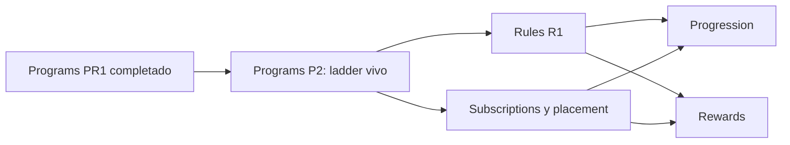

# Roadmap de IB Service

Este directorio convierte las decisiones de dominio y arquitectura en entregas
verificables. El roadmap registra qué se pretende construir, qué decisiones
faltan y qué evidencia permite considerar terminada cada etapa.

No es una fuente de verdad alternativa: los BDS gobiernan la semántica del
negocio y `docs/rules/` gobierna las restricciones técnicas. Si un documento de
roadmap contradice esas fuentes, debe corregirse el roadmap.

## Índice por feature

| Feature | Estado | Etapa actual | Última revisión |
| --- | --- | --- | --- |
| [`Modules`](modules/README.md) | Completado | M1 completado; próximo M2 condicionado a consumidor | 2026-09-11 |
| [`Plans`](plans/README.md) | P1 completado | Extensión de aprobación requerida por Subscriptions S1 | 2026-09-15 |
| [`Programs`](programs/README.md) | PR1 y P2 completados | Ladder vivo de umbrales | 2026-09-14 |
| [`Rules`](rules/README.md) | Completado | R1 y R2 completados | 2026-09-15 |
| [`Subscriptions`](subscriptions/README.md) | S1 completada | Suscripciones y placement administrativo | 2026-09-16 |

## Secuencia entre features

La jerarquía del dominio determina el orden inicial. Tras PR1, P2 cierra el
ladder vivo de umbrales. Rules y Subscriptions pueden avanzar después;
Progression y Rewards dependen de ambos.

```text
Modules M1
    ↓
Plans P1
    ↓
Programs PR1
    ↓
Programs P2  (ladder vivo de umbrales)
    ├──→ Rules R1 ──────────────┐
    └──→ Subscriptions/placement ┤──→ Progression
                                 └──→ Rewards
```



- `Modules M1` no publica contratos inter-feature especulativos. Sus objetos
  tipados viven como DTOs internos hasta que un consumidor real exija un
  `Contracts/Data/V1`.
- `Plans P1` es el primer consumidor real de `Modules`; su necesidad concreta
  origina el primer puerto de entrada público de `Modules` y, con él, el
  primer `Contracts/Data` versionado.
- `Programs` no consume libremente el catálogo de módulos: primero debe obtener
  el contexto y los módulos habilitados por el plan propietario.
- `Programs P2` implementa el ladder vivo de umbrales. No publica ni
  versiona programas. Rules y Subscriptions abren inventario tras P2.
- `Subscriptions` conserva una única suscripción abierta global por usuario,
  historia terminal y placement libre o fijado. S1 está implementada de extremo
  a extremo (contextos, persistencia, solicitud/moderación, ciclo de vida,
  fijación y salvaguarda de archivo), con permisos, Postman y suite PostgreSQL
  verificados. Progression y Rewards pueden consumir ese contexto sin reabrir
  S1 para contratos especulativos.
- Una frontera pública se diseña junto con la entrega vertical del consumidor,
  no como una entrega aislada del proveedor.

## Iteración estándar por feature

Cada feature avanza mediante los siguientes documentos. Los nombres de clases,
tablas y endpoints siguen siendo provisionales hasta cerrar la etapa que los
define.

1. **Inventario de casos de uso:** intenciones de actores y resultados
   observables, todavía sin forzar nombres de implementación.
2. **Modelo de dominio:** agregados, estados, invariantes y límites
   transaccionales.
3. **Entregas verticales:** incrementos utilizables de entrada a persistencia,
   con criterios de aceptación.
4. **Modelo de datos de la primera entrega:** tablas, restricciones, índices y
   decisiones de concurrencia requeridas por el primer incremento.
5. **Implementación de la primera entrega:** contratos, repositorios en memoria
   y PostgreSQL, contract tests, casos de uso y adaptadores de entrada.

Una etapa puede descubrir cambios para una etapa anterior. En ese caso se
actualizan ambos documentos y se registra expresamente la decisión; no se
mantiene una secuencia artificial a costa de inconsistencias.

## Estados

| Estado | Significado |
| --- | --- |
| No iniciado | Aún no se ha trabajado la etapa. |
| En descubrimiento | Se están recopilando necesidades y alternativas. |
| Pendiente de decisión | Existe información suficiente, pero falta cerrar una decisión explícita. |
| Listo | Alcance y criterios de salida están definidos para comenzar. |
| En curso | Hay trabajo de implementación o validación activo. |
| Completado | Se cumplieron los criterios de salida y existe evidencia verificable. |
| Bloqueado | No puede avanzarse sin una dependencia o decisión externa identificada. |

## Criterios de avance

| Etapa | Criterio de salida mínimo |
| --- | --- |
| Inventario | Actores, intenciones, resultados y dudas están enumerados; el alcance de la primera entrega puede seleccionarse. |
| Dominio | Agregados, invariantes, estados y transacciones de la primera entrega están acordados. |
| Entregas | Cada incremento tiene valor observable, dependencias y criterios de aceptación. |
| Datos | El esquema de la primera entrega tiene columnas, tipos, restricciones, índices y estrategia de concurrencia definidos. |
| Implementación | El incremento funciona de extremo a extremo y la misma suite contractual valida ambos repositorios. |

## Mantenimiento

- El `README.md` de cada feature conserva el estado actual, las decisiones
  confirmadas y el próximo paso.
- Cada cambio de estado actualiza la fecha de revisión y enlaza su evidencia.
- Las hipótesis se etiquetan como tales y las decisiones pendientes no se
  convierten en nombres o estructuras definitivas.
- No se agregan estimaciones ni fechas de entrega sin responsables y
  dependencias acordados.
- Al incorporar un feature, se crea su directorio siguiendo esta iteración y se
  añade al índice anterior.
