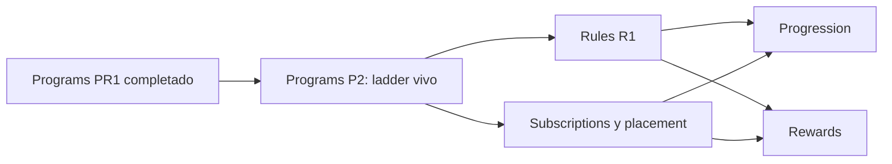

# Programs P2: planificación de la segunda entrega

Estado: **Completado**
Dependencia satisfecha: `Programs PR1` completado
Última revisión: 2026-09-14

## Objetivo

Cerrar el ladder de umbrales de entrada como propiedad viva de cada programa.
P2 no publica, no versiona y no congela configuración. Las evaluaciones
posteriores leen el `entry_threshold` vigente.

## Decisión corregida

Planes y programas conservan identidad estable. Un único entero no negativo
por programa define el suelo de entrada. No hay snapshot de configuración,
umbral, placement ni run. Las ponderaciones por símbolo pertenecen a
Rules/Progression y no alteran el umbral.

## Alcance mínimo de P2

| Área | Intención observable | Reglas BDS |
| --- | --- | --- |
| Umbral | Cada programa declara un `entry_threshold` entero ≥ 0, mutable. | `BR-PROGRAM-010`, `BR-PROGRAM-014` |
| Ladder | Los umbrales del plan son estrictamente crecientes con la posición. | `BR-PROGRAM-003`, `BR-PROGRAM-011`, `BR-PROGRAM-012` |
| Placement futuro | El IB queda en el programa de mayor posición con `puntos >= umbral`. | `BR-PROGRAM-013` |

Documentos de la iteración P2:

| Etapa | Documento | Estado |
| --- | --- | --- |
| Inventario | [`07-p2-use-case-inventory.md`](07-p2-use-case-inventory.md) | Completado |
| Dominio | [`08-p2-domain-model.md`](08-p2-domain-model.md) | Completado |
| Entregas verticales | [`09-p2-vertical-deliveries.md`](09-p2-vertical-deliveries.md) | P2 completado |
| Modelo de datos | [`10-p2-data-model.md`](10-p2-data-model.md) | Completado |
| Implementación | [`11-p2-implementation.md`](11-p2-implementation.md) | P2 completado |

## Fuera de P2

- Publicación o versionado de programas o planes.
- Snapshots de módulo, umbral, placement o run.
- Catálogo de reglas, ponderaciones por símbolo y scope.
- Suscripciones y placement ejecutado.
- Runs de progresión y rewards.

## Próximo paso

Ninguno dentro de P2. Evidencia en
[`11-p2-implementation.md`](11-p2-implementation.md). Rules R1 y
suscripciones/placement quedan fuera de esta entrega.
