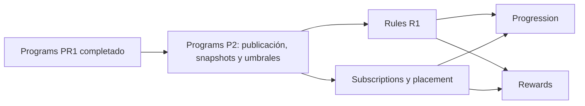

# Programs P2: planificación de la segunda entrega

Estado: **Listo**
Dependencia satisfecha: `Programs PR1` completado
Última revisión: 2026-09-14

## Objetivo

Cerrar los prerrequisitos de dominio que PR1 dejó fuera y que los BDS exigen
antes de que Rules, Subscriptions/Placement, Progression o Rewards puedan
avanzar como entregas verticales utilizables.

P2 no implementa todavía Rules, Progression ni Rewards. Documenta el alcance,
las reglas BDS trazadas y las decisiones cerradas para la entrega vertical de
publicación, snapshots y umbrales.

## Por qué P2 precede a Rules / Progression / Rewards

PR1 entregó identidad, orden relativo y selección administrativa de módulos.
Eso no basta para:

- publicar una configuración inmutable del programa;
- congelar la semántica y capacidades de módulo usadas en ejecución;
- resolver placement con umbrales no ambiguos;
- suscribir un usuario y asignarle un placement;
- asignar versiones de regla a un programa y módulo;
- evaluar runs de progresión o calcular recompensas.

## Alcance mínimo de P2

| Área | Intención observable | Reglas BDS |
| --- | --- | --- |
| Publicación | Publicar una configuración de programa con al menos un módulo seleccionado y habilitado por el plan. | `BR-PROGRAM-005`, `BR-PROGRAM-006` |
| Versionado | Una configuración publicada permanece inmutable; un cambio funcional crea una nueva versión. | `BR-PROGRAM-014`, `BR-MODULE-007`, `BR-MODULE-009` |
| Snapshot | Al publicar, se conserva un snapshot de semántica y capacidades del módulo; la disponibilidad y el procesamiento actuales se consultan por relación directa al catálogo. | `BR-MODULE-007`, `BR-MODULE-008`, `BR-MODULE-009` |
| Umbrales | Entero de entrada por programa, estrictamente creciente con la posición; intervalos contiguos sin solapes. | `BR-PROGRAM-003`, `BR-PROGRAM-010`–`013` |

Documentos de la iteración P2:

| Etapa | Documento | Estado |
| --- | --- | --- |
| Inventario | [`07-p2-use-case-inventory.md`](07-p2-use-case-inventory.md) | Completado |
| Dominio | [`08-p2-domain-model.md`](08-p2-domain-model.md) | Completado |
| Entregas verticales | [`09-p2-vertical-deliveries.md`](09-p2-vertical-deliveries.md) | Listo |
| Modelo de datos | [`10-p2-data-model.md`](10-p2-data-model.md) | Listo |

## Modelo de umbral cerrado

Un solo `entry_threshold` entero ≥ 0 por programa. Se descarta min-max
explícito: con monotonía estricta el techo implícito de la posición `i` es el
suelo de `i+1`; el último nivel queda abierto. Placement futuro:
mayor posición con `puntos >= umbral` (`BR-PROGRAM-013`).

## Dependencias

| Dependencia | Rol |
| --- | --- |
| `Programs PR1` | Identidad, orden relativo y selección administrativa. |
| `Plans P1` / `ResolvePlanContextPort` | Contexto del plan y módulos habilitados. |
| `Modules` catálogo | Semántica y capacidades para el snapshot. |
| BDS `plans-and-subscriptions` v0.9 | Umbrales, publicación e invariantes. |

## Fuera de P2

- Catálogo reutilizable de reglas (`Rules`).
- Suscripciones y placement ejecutado (`Subscriptions`).
- Runs, contribuciones y puntos (`Progression`).
- Recompensas y settlement (`Rewards`).
- Actividad o scope de instrumentos (`BR-MODULE-004`).
- Eventos Kafka y puerto inverso Programs → Plans.
- Activación, desactivación o archivo del programa como ciclo de vida propio.

## Decisiones pendientes que P2 no cierra

Siguen abiertas en los BDS (no inventadas aquí): políticas de suscripción y
anclaje; ventanas/runs de progresión; estados y fórmulas de rewards.

## Criterios Listo (cumplidos)

1. Inventario de publicación, versionado, snapshot y umbrales aceptado.
2. Modelo de dominio de configuración publicada y ladder acordado.
3. Forma del umbral cerrada en el BDS (`BR-PROGRAM-010`–`014`).
4. Criterios de aceptación de la entrega vertical documentados.
5. Sin puertos especulativos hacia Rules/Subscriptions; el consumidor real
   originará el contrato.

## Próximo paso

Implementación vertical de P2 (migraciones, casos de uso, HTTP, contract
tests) registrada en un documento de evidencia de implementación cuando
arranque el código. Tras P2 implementado, Rules y Subscriptions pueden
abrir inventario.
