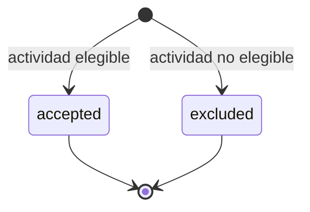

# Progression PG1: agregados, estados y transacciones

Estado: **Completado para PG1**
Dependencia satisfecha: [`01-use-case-inventory.md`](01-use-case-inventory.md)
Última revisión: 2026-09-17

## Propósito

Definir el límite del agregado de evaluación y contribución, sus estados e
invariantes y las decisiones indivisibles de PG1. Los nombres describen
responsabilidades de dominio y no obligan todavía a una clase, tabla o endpoint
homónimo. Runs y mutación de placement quedan fuera de este modelo.

## Agregados confirmados

| Concepto | Responsabilidad | Decisión |
| --- | --- | --- |
| Evaluación de actividad | Conserva el resultado de procesar una actividad para progresión: aceptada o excluida, con contexto histórico al ocurrir y la ventana derivada. | Agregado raíz de PG1. Inmutable una vez persistido. |
| Contribución | Registra métrica nativa, unidad, regla y versión aplicadas y puntos obtenidos. | Hijo opcional de la evaluación; solo existe si el resultado es `accepted`. |
| Plan | Gobierna disponibilidad y período de progresión obligatorio. | Agregado externo consultado mediante frontera pública. |
| Suscripción / placement | Proveen beneficiario, programa vigente al ocurrir y condición de fijación. | Agregado externo consultado mediante frontera pública. |
| Regla / versión / asignación | Proveen la conversión `points_per_quantity_unit` vigente al ocurrir. | Agregados externos del catálogo Rules; no se duplican en Progression. |
| Actividad normalizada | Hecho de módulo consultado vía Modules. | Origen externo; no es agregado de Progression. |

La evaluación y la contribución no son agregados hermanos independientes. Una
evaluación `accepted` nace con su contribución en la misma decisión; una
`excluded` no crea contribución.

## Estados de la evaluación

| Estado | Contribución | Mutaciones admitidas |
| --- | --- | --- |
| `accepted` | Obligatoria | Ninguna; registro inmutable. |
| `excluded` | No existe | Ninguna; registro inmutable con motivo del catálogo inicial. |

No existe estado intermedio editable. No se recalcula ni se convierte una
evaluación ya persistida cuando cambian ponderaciones, selecciones o umbrales
(`BR-POINTS-009`).

## Ventana asociada

Cada evaluación conserva el intervalo de ventana derivado del período del plan
y de `occurred_at` (`BR-PLAN-018`, `BR-POINTS-019`). Ese intervalo identifica a
qué ventana pertenecerían los puntos si la evaluación es `accepted`.

La condición `late_activity` solo aplica cuando un run posterior ya cerró esa
ventana. PG1 deja la forma lista para reconocerla; el cierre efectivo de
ventanas pertenece a PG2.

## Pausa y plan inactivo

Mientras un módulo está en pausa de procesamiento, su actividad permanece en
origen. Al reanudarlo, se evalúa solo si su ventana original sigue abierta; si
ya cerró, nace una evaluación `excluded` con `window_closed_after_pause`
(`BR-POINTS-012`, `BR-POINTS-013`).

Un plan inactivo detiene Progression para sus suscripciones: no inicia consultas
de actividad, evaluaciones, contribuciones ni runs. La reactivación fija un nuevo
inicio operativo y no recupera actividad previa, incluso si su ventana original
continúa abierta (`BR-POINTS-028`). Si una evaluación que ya estaba en curso
alcanza la verificación final con el plan inactivo, queda `excluded` con
`plan_inactive`; no se deja pendiente para reintentar al reactivar.

## Motivos de exclusión

Una evaluación `excluded` conserva exactamente un motivo del catálogo inicial
del BDS: `placement_fixed`, `plan_inactive`, `module_not_selected`,
`module_inactive`, `unit_mismatch`, `scale_exceeded`,
`window_closed_after_pause`, `late_activity`, `no_active_subscription`,
`no_applicable_rule`.

## Invariantes

- Toda evaluación responde qué actividad, beneficiario, plan, programa, módulo,
  métrica e instante de ocurrencia participaron (`BR-POINTS-001`,
  `BR-POINTS-022`).
- Los puntos solo existen en una contribución aceptada y no son dinero
  (`BR-POINTS-002`).
- Solo aportan puntos los módulos habilitados por el plan y seleccionados por
  el programa vigente al ocurrir; un programa sin selecciones no genera puntos
  (`BR-POINTS-003`).
- La regla aplicada identifica módulo, métrica, ponderación y scope; en esta
  fase el scope efectivo es `all` (`BR-POINTS-004`, `BR-POINTS-006`).
- La conversión usa aritmética decimal exacta con máximo ocho decimales; una
  escala mayor produce exclusión, no redondeo (`BR-POINTS-007`).
- Existe como máximo una evaluación por actividad fuente y beneficiario. La
  contribución aceptada es idempotente además respecto a la versión de regla
  (`BR-POINTS-008`).
- Una contribución registrada no se recalcula silenciosamente
  (`BR-POINTS-009`).
- Suscripción, placement y asignación o versión de regla se resuelven al
  instante de ocurrencia (`BR-POINTS-015`, `BR-SUBSCRIPTION-011`).
- Como máximo una asignación activa `points_per_quantity_unit` por programa,
  módulo y métrica/unidad (`BR-POINTS-016`, `BR-RULE-016`).
- Una misma actividad no recibe dos ponderaciones para la misma métrica; el
  total de la ventana suma métricas y módulos distintos (`BR-POINTS-017`).
- Actividad tardía produce evaluación excluida sin puntos (`BR-POINTS-021`).
- Sin conversión FX: unidad incompatible se excluye (`BR-POINTS-030`).
- Administración consulta evaluaciones y contribuciones; el usuario IB no
  (`BR-POINTS-031`).

## Límites transaccionales

- **Consultar actividad:** lectura pull-only desde Modules. No crea evaluación.
- **Evaluar (aceptar):** resuelve contexto al `occurred_at`, valida elegibilidad
  y precisión, aplica la regla vigente y crea de forma indivisible una
  evaluación `accepted` con su contribución. Un fallo no deja evaluación
  parcial sin contribución ni contribución sin evaluación.
- **Evaluar (excluir):** resuelve el motivo del catálogo y crea de forma
  indivisible una evaluación `excluded` sin contribución.
- **Reprocesar:** si ya existe evaluación para la misma actividad y
  beneficiario, no crea otra; conserva el resultado previo.
- **Consultar administrativamente:** lectura de evaluaciones y contribuciones;
  no muta.

No existe transacción de run, cierre de ventana ni cambio de placement en PG1.

La idempotencia debe impedir evaluaciones duplicadas ante consultas o
reintentos concurrentes de la misma actividad. El mecanismo concreto se define
en el modelo de datos; no puede depender solo de una comprobación previa sin
protección de concurrencia.

## Fronteras entre features

PG1 es el primer consumidor real de estas fronteras; no se publican contratos
especulativos:

- **Modules M3:** consulta de actividad normalizada pull-only.
- **Subscriptions:** suscripción y placement en `occurred_at`, incluida la
  condición de fijación.
- **Plans:** condición activa/inactiva y período de progresión obligatorio.
- **Rules:** asignación y versión `points_per_quantity_unit` vigentes en
  `occurred_at`, con unicidad por programa, módulo y métrica/unidad.
- **Programs:** programa del placement y si el módulo estaba seleccionado en el
  instante de ocurrencia. El mecanismo de consulta histórica o vigente se
  define en la entrega vertical; la invariante de dominio no se relaja.

Los cruces usan puertos y datos contractuales versionados. Progression no
comparte modelos internos, repositories ni detalles de persistencia ajenos.

## Fuera del modelo PG1

- Runs, resultados por suscripción y mutación automática de placement.
- Forma de tablas, restricciones, índices y locks concretos.
- Rutas HTTP, Commands, Resources y forma exacta de consultas paginadas.
- Kafka como vía principal de actividad.
- Reversas y corrección de contribuciones ya registradas.
- Conversión FX.
- Scope instrumental distinto de `all`.
- Catálogo paralelo de reglas de contribución.

## Criterios de salida

- Agregado, estados e invariantes de PG1 están definidos y trazados al BDS.
- Cada intención aceptada de PG1 tiene una transición o lectura coherente.
- Los motivos de exclusión del inventario están representados en el modelo.
- Las fronteras con Modules, Subscriptions, Plans, Rules y Programs están
  definidas sin adelantar runs ni contratos especulativos.
- El alcance permite diseñar las entregas verticales de PG1.
