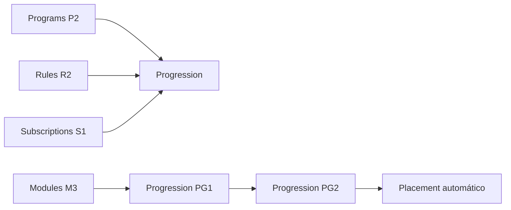

# Roadmap del feature Progression

Estado: **Modelo de datos PG1 completado; implementación bloqueada por Modules M3**
Dependencias satisfechas: `Programs P2`, `Rules R2` y `Subscriptions S1` completados
Dependencia de implementación de PG1: `Modules M3` (actividad normalizada pull-only)
Extensiones pendientes en proveedores: período obligatorio en Plans; umbral `0` del primer programa en Programs; unicidad por métrica/unidad en Rules
Última revisión: 2026-09-17

## Objetivo

`Progression` convierte actividad heterogénea de módulos en puntos sin
dimensión, conserva evaluaciones auditables y, en una segunda entrega, ejecuta
runs por plan y ventana para mantener, subir o bajar el placement.

## Posición en la secuencia

Rules aporta asignaciones históricas y la estrategia `points_per_quantity_unit`.
Subscriptions aporta el contexto vigente e histórico de suscripción y
placement. Modules M3 aportará la consulta de actividad normalizada. Progression
es el primer consumidor real de esa actividad y de la evaluación de reglas para
puntos.

## Primera entrega: PG1

Consulta pull-only de actividad normalizada, evaluación durable (aceptada o
excluida) y contribuciones auditables. No ejecuta runs ni mueve placement.

| Etapa | Documento | Estado |
| --- | --- | --- |
| 1. Inventario de casos de uso | [`01-use-case-inventory.md`](01-use-case-inventory.md) | Completado para PG1 |
| 2. Agregados, estados y transacciones | [`02-domain-model.md`](02-domain-model.md) | Completado para PG1 |
| 3. Entregas verticales | [`03-vertical-deliveries.md`](03-vertical-deliveries.md) | Completado para PG1 |
| 4. Modelo de datos | [`04-pg1-data-model.md`](04-pg1-data-model.md) | Completado para PG1 |
| 5. Implementación y contract tests | [`05-pg1-implementation.md`](05-pg1-implementation.md) | Plan preparado; bloqueado por adapter M3 |

## Segunda entrega: PG2

Runs por plan y ventana, resultados independientes por suscripción y cambios
de placement conforme al ladder vivo. Se documentará tras cerrar PG1, con
`06-second-delivery-planning.md` y el ciclo 07–11.

## Decisiones confirmadas

- Los puntos no son dinero (`BR-POINTS-002`).
- Se reutiliza el catálogo `Rules` (`Rule`, `RuleVersion`, `RuleAssignment`);
  no hay catálogo paralelo de contribución.
- Como máximo una asignación activa `points_per_quantity_unit` por programa,
  módulo y métrica/unidad (`BR-POINTS-016`, `BR-RULE-016`).
- El total de la ventana suma contribuciones de métricas y módulos distintos;
  no ponderaciones duplicadas de la misma métrica (`BR-POINTS-017`).
- Solo aportan puntos los módulos habilitados por el plan y seleccionados por
  el programa vigente al ocurrir (`BR-POINTS-003`).
- El período de progresión es obligatorio en el plan (`daily` / `weekly` /
  `monthly`, UTC); cambios rigen desde la siguiente ventana
  (`BR-PLAN-018`, `BR-PLAN-019`).
- Ventanas fijas con reinicio de puntos; margen técnico global de una hora
  (`BR-POINTS-019`, `BR-POINTS-020`).
- Contexto de suscripción, placement y regla por instante de ocurrencia;
  umbrales vigentes al run (`BR-POINTS-015`).
- Actividad tardía: evaluación durable sin puntos (`BR-POINTS-021`).
- Catálogo inicial de motivos de exclusión cerrado (BDS v0.6).
- Precisión decimal máxima de ocho decimales; sin redondeo silencioso
  (`BR-POINTS-007`).
- Sin conversión FX en PG1/PG2 (`BR-POINTS-030`); reversas fuera de alcance.
- Pausas: al reanudar se procesa solo si la ventana sigue abierta
  (`BR-POINTS-013`).
- Plan inactivo: Progression no consulta ni evalúa actividad, no crea
  contribuciones ni ejecuta runs; reactivar no recupera actividad previa
  (`BR-POINTS-028`).
- Retiro de módulo: efecto inmediato (`BR-POINTS-029`, `BR-PLAN-020`).
- Run por plan y ventana con resultado por suscripción; fallos parciales
  reintentables; run completado no se reabre (`BR-POINTS-023`,
  `BR-POINTS-027`).
- Placement objetivo directo, con salto de varios niveles; cero puntos
  resuelven el primer programa (`BR-POINTS-024`, `BR-POINTS-025`,
  `BR-PROGRAM-015`).
- Suscripción a mitad de ventana participa en el cierre actual
  (`BR-POINTS-026`).
- Administración consulta evaluaciones, contribuciones, runs y resultados;
  el cliente no (`BR-POINTS-031`).

## Fuera de PG1

- Ejecución de runs y mutación automática de placement (PG2).
- Reversas y corrección de contribuciones ya registradas.
- Conversión FX entre monedas.
- Scope instrumental distinto de `all` (Modules M2).
- Ventana móvil.
- Contratos públicos especulativos de Subscriptions, Rules o Modules sin el
  consumidor real de la vertical correspondiente.
- Kafka como vía principal de actividad: PG1 usa consulta pull-only vía M3.

## Referencias canónicas

- [`progression.bds.md`](../../bds/progression.bds.md)
- [`plans-and-subscriptions.bds.md`](../../bds/plans-and-subscriptions.bds.md)
- [`rewards.bds.md`](../../bds/rewards.bds.md)
- [`architecture.md`](../../rules/architecture.md)
- [`strategies.md`](../../rules/strategies.md)
- [`integrations.md`](../../rules/integrations.md)

## Próximo paso

Implementar el primer adapter de Modules M3 conforme a
[`06-m3-progression-activity-contract.md`](../modules/06-m3-progression-activity-contract.md).
Después, ejecutar las sesiones de [`05-pg1-implementation.md`](05-pg1-implementation.md)
hasta habilitar PG1 de extremo a extremo.
