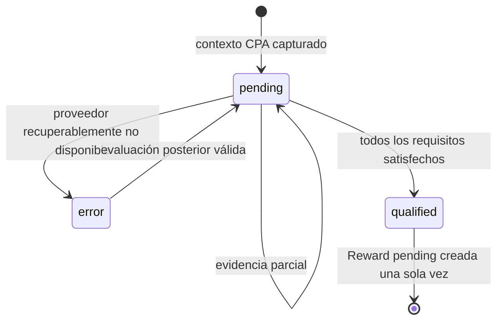

# RWD2: modelo de dominio CPA

Estado: **Listo**
Última revisión: 2026-10-02

## Agregados y responsabilidades

- **CPA Context** es el registro inmutable de una adquisición. Conserva
  referido, IB, plan, programa, módulo, asignación, versión de regla, instante
  de captura, requisitos y snapshot instrumental.
- **CPA Verification Progress** es una proyección única del cumplimiento del
  contexto. No es una fuente de verdad financiera ni una lista de intentos.
- **Reward** es el ledger de la obligación económica. Nace solo después de una
  evaluación calificada y permanece `pending` en RWD2.
- **Módulo proveedor** entrega evidencia normalizada. No interpreta la regla ni
  crea estados de Rewards.

## Ciclo de vida

`qualified` describe el cumplimiento de requisitos, no el settlement. El estado
financiero de la Reward permanece separado y no cambia esta proyección.

## Evaluación

1. El runner selecciona contextos sin Reward de módulos activos y `running`.
2. Obtiene evidencia mediante el puerto especializado del módulo. La selección
   de proveedor es independiente de la regla económica.
3. Solicita evidencia desde `captured_at` hasta el corte semiabierto `[from,
   until)`.
4. La evaluación suma volumen cerrado únicamente de los símbolos/grupos CPA
   congelados y depósitos certificados solo de la moneda exacta configurada.
5. Actualiza el progreso; si ambos requisitos se cumplen, crea una única Reward
   `pending` y relaciona el contexto con ella en la misma transacción.

## Invariantes

La prescripción anterior de Strategy por `module_code + strategy_type` queda
sustituida por [RWD-A1](09-rwd-a1-documentation-alignment.md). El código actual
delega evaluación a una Strategy económica con factory tipada desde RWD-A2.1;
las factories de proveedores quedan pendientes de [RWD-A2](10-rwd-a2-cpa-volume-refactor.md).

- La progresión del IB, cambios de placement, reglas nuevas o símbolos actuales
  no reescriben el contexto CPA ya capturado.
- No existe ponderación, coeficiente ni recorrido de referidos en CPA.
- Una indisponibilidad de Broker Service o Finance se informa como error
  sanitizado y reintentable; nunca califica ni descarta definitivamente.
- No se consulta ni persiste información de depósito o actividad superior a la
  necesaria para justificar cantidades y referencias de evidencia.
