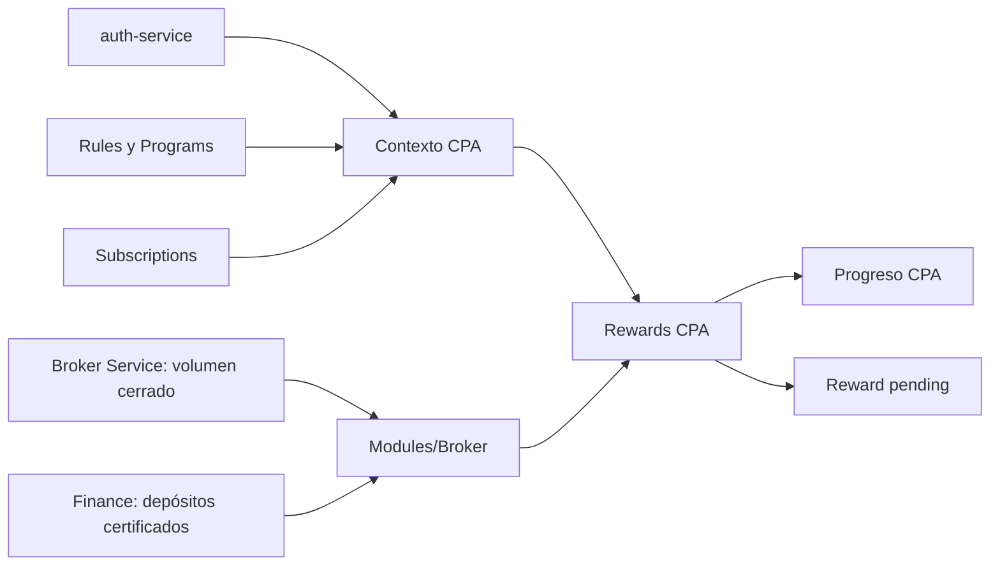

# Roadmap del feature Rewards

Estado: **Cierre de código E2E completado localmente; RWD-A1/A2 completadas; validación integrada con ib-labs pendiente**
Dependencias: `Rules R2`, `Subscriptions S1`, Modules M5, `auth-service` V1 y
Finance interno para depósitos certificados
Última revisión: 2026-10-06

## Objetivo

`Rewards` registra las obligaciones económicas de IB y conserva su causa,
snapshot y estado. Finance es autoridad del settlement. RWD2 crea la obligación
CPA `pending`; RWD3.1 la asienta de forma síncrona e idempotente en Finance.
RWD3.2 incorpora reversas, compensaciones y cancelación. El cierre local E2E
completa coordinación financiera, settlement PnL, snapshots de volumen y lecturas
HTTP; la validación contractual S2S permanece pendiente.

## Posición en la secuencia

Auth origina el contexto CPA. Rules, Programs y Subscriptions fijan su
configuración comercial. Modules/Broker obtiene evidencia normalizada desde
Broker Service y Finance; Rewards la interpreta y conserva el progreso y el
ledger.

## RWD1 — inventario

| Etapa | Documento | Estado |
| --- | --- | --- |
| 1. Inventario de casos de uso | [`01-use-case-inventory.md`](01-use-case-inventory.md) | Completado y corregido |

## RWD2 — verificación CPA, progreso y ledger `pending`

| Etapa | Documento | Estado |
| --- | --- | --- |
| 2. Modelo de dominio | [`02-cpa-domain-model.md`](02-cpa-domain-model.md) | Listo |
| 3. Entregas verticales | [`03-cpa-vertical-deliveries.md`](03-cpa-vertical-deliveries.md) | Listo |
| 4. Modelo de datos | [`04-cpa-data-model.md`](04-cpa-data-model.md) | Listo |
| 5. Implementación y contract tests | [`05-cpa-implementation-plan.md`](05-cpa-implementation-plan.md) | RV1-RV3 implementados; contract tests pendientes |

## RWD3 — settlement de Rewards

| Etapa | Documento | Estado |
| --- | --- | --- |
| 6. Settlement síncrono CPA | [`06-rwd3-settlement-sync.md`](06-rwd3-settlement-sync.md) | RWD3.1 implementado; validación contractual pendiente |
| 7. Correcciones y reconciliación selectiva | [`07-rwd3-corrections-and-reconciliation.md`](07-rwd3-corrections-and-reconciliation.md) | RWD3.2 implementado; validación contractual pendiente |

## RWD4 — volumen tradeado y PnL negativo

| Etapa | Documento | Estado |
| --- | --- | --- |
| 8. Descubrimiento, contratos y entregas | [`08-rwd4-volume-and-negative-pnl.md`](08-rwd4-volume-and-negative-pnl.md) | Implementados localmente; S2S requisito de cierre E2E |
| RWD4.2.2: runner, recuperación y generación | [Plan E2E](11-e2e-historical-pnl.md#rwd422-runner-pnl-recuperacion-y-generacion-de-rewards) | Completada localmente; generación y settlement habilitados por defecto |
| Cierre local E2E | [Entrega y evidencia](11-e2e-historical-pnl.md#entrega-de-cierre-local-e2e) | Cinco incrementos completados localmente; validación posterior con ib-labs |

## Alineación previa a PnL

| Etapa | Documento / evidencia | Estado |
| --- | --- | --- |
| RWD-A1: alineación documental | [`09-rwd-a1-documentation-alignment.md`](09-rwd-a1-documentation-alignment.md) | Completada; no cambia código |
| RWD-A2: refactor CPA/volumen | [`10-rwd-a2-cpa-volume-refactor.md`](10-rwd-a2-cpa-volume-refactor.md) | Completada; A2.1–A2.3 |
| Ampliación del corte histórico Broker–IB | [Plan E2E](11-e2e-historical-pnl.md) | Implementada localmente; S2S pendiente; desfase temporal aceptado como bug conocido |
| RWD4.2.1: configuración y cálculo | [RWD4.2](08-rwd4-volume-and-negative-pnl.md) | Completada localmente |
| RWD4.2: runner económico/cierre | [RWD4.2](08-rwd4-volume-and-negative-pnl.md) | Runner, settlement y consultas locales completados; S2S y datos reales pendientes |

Cada modalidad conserva su UseCase; factories de evidencia y cálculo son
independientes. Rules mantiene definiciones versionadas. No hay pipeline común
obligatorio ni engine universal. A2.1/A2.2 implementan las factories económicas CPA y volumen;
A2.3 completa las factories específicas de proveedores de evidencia.

## Decisiones confirmadas

- La captura CPA permanece idempotente por referido e IB y congela requisitos,
  versión de regla y símbolos/grupos CPA.
- CPA no participa en Progression, pesos ni red multinivel.
- El módulo Broker obtiene volumen cerrado de Broker Service y depósitos
  certificados directamente de Finance; Broker Service no compone depósitos.
- Los requisitos de volumen y depósito se satisfacen acumulativamente y sin FX.
- Cada contexto tiene un solo progreso visible. `reward_id` se conserva en
  `cpa_context`, nunca en el progreso.
- Una evaluación calificada crea una única Reward `pending`; RWD3.1 la envía a
  Finance con idempotencia estable y transiciona a `settled` solo ante comisión
  `posted` creada o duplicada.
- `pending` y `failed` de CPA/volumen/PnL son seleccionables por settlement, bajo condiciones operativas y sin holds. Generación y settlement PnL están habilitados por defecto con controles independientes para desactivarlos. Finance conserva el asiento y IB su resumen operativo y solicitud congelada.
- Cancelación, reversa y compensación son administrativas, idempotentes y auditables. La reconciliación recurrente solo trata incertidumbre u holds, nunca el histórico financiero confirmado.

## CPA por puntos

[Refactor CPA](12-cpa-points-refactor.md): sustituye el modelo anterior sin
compatibilidad. Dos umbrales de puntos independientes, conversión por módulo
para volumen y común para depósitos, contribuciones durables por entrada,
cortes por fuente y asociación administrativa histórica por programa.
Esta especificación sustituye los diseños CPA de RWD2 y la equivalencia CPA de A2.
El programa se resuelve por la suscripción del IB, no por la del referido.
Las reglas detalladas vigentes pertenecen al BDS de Rewards.

## Próximo paso

[Plans P3](../plans/06-template-version-bindings.md), completada localmente, cierra la creación
administrativa de bindings de pago necesaria para preparar los escenarios de
ib-labs por HTTP. Los cierres locales previos consumían bindings preparados.

El handler de Trading identifica cierres por `event_name = position_closed`,
siguiendo el precedente de broker-service. La librería deserializa Avro/JSON;
IB valida el payload y conserva referencias técnicas sin atribuir un esquema
no verificado. Los productores y fixtures de ib-labs deben incluir `event_name`;
su ausencia se ignora, y no se ejecuta replay automático de mensajes descartados.

La recuperación Finance se adapta al GET real mediante una segunda consulta
al listado paginado de wallets, enlazada por ID exacto. La evidencia local y
los límites S2S se registran en [RWD3.2](07-rwd3-corrections-and-reconciliation.md).

El [plan E2E y su evidencia](11-e2e-historical-pnl.md) completa su alcance local. Las lecturas
de margen son la fuente seleccionada bajo el supuesto de continuidad hasta el
corte; el desfase temporal queda documentado sin detección ni gracia.

La configuración/cálculo RWD4.2.1 y
[RWD4.2.2](11-e2e-historical-pnl.md#rwd422-runner-pnl-recuperacion-y-generacion-de-rewards)
están completados localmente. El cierre incorpora settlement PnL, traducción de
niveles IB → Finance, coordinación/reconciliación y lecturas HTTP. El próximo
paso es validar los flujos integrados con ib-labs cuando esté listo, incluyendo
contratos Broker/IAM/Finance, scheduler, fallos de transporte y datos controlados.
Esa evidencia no bloquea habilitación del código; sigue requerida para declarar
completo el E2E y no equivale a validación con datos reales.

N-PnL por nivel y moneda (2026-10-06): [entrega y evidencia](13-negative-pnl-level-currency.md).
