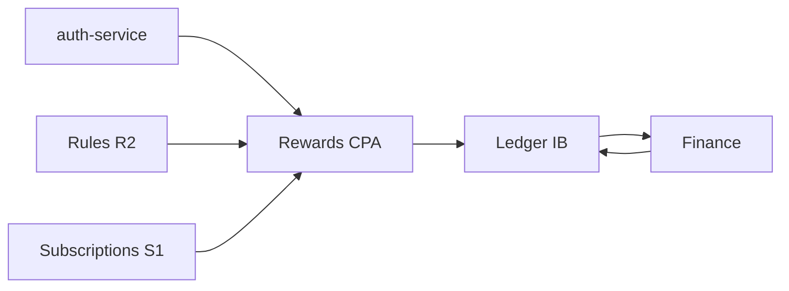

# Roadmap del feature Rewards

Estado: **Inventario RWD1 completado; primera vertical CPA bloqueada por fórmula y contratos externos**
Dependencias: `Rules R2`, `Subscriptions S1`, evento V1 de `auth-service` y
frontera financiera para verificar depósitos y solicitar el pago
Última revisión: 2026-09-28

## Objetivo

`Rewards` registra en la tabla `rewards`, ledger propio de IB, las obligaciones
económicas que originan CPA, volumen, PnL y estrategias futuras. IB conserva la
causa, el snapshot y el estado de la recompensa; Finance es la autoridad de su
settlement.

## Posición en la secuencia

Rules aporta reglas, versiones y asignaciones históricas. Subscriptions aporta
el contexto histórico de beneficiario, plan, programa y placement. Auth origina
el hecho de adquisición CPA y Finance confirma el asentamiento de una obligación.

## Primera entrega: RWD1 — CPA

Captura de una adquisición CPA desde Auth, congelación de su contexto y creación
idempotente de una obligación en el ledger de IB. La solicitud a Finance y la
transición de `pending` a `settled` pertenecen a la misma vertical, pero no se
implementan hasta cerrar sus bloqueos.

| Etapa | Documento | Estado |
| --- | --- | --- |
| 1. Inventario de casos de uso | [`01-use-case-inventory.md`](01-use-case-inventory.md) | Completado; entrega bloqueada |
| 2. Modelo de dominio | Pendiente | Bloqueado por fórmula CPA |
| 3. Entregas verticales | Pendiente | — |
| 4. Modelo de datos | Pendiente | — |
| 5. Implementación y contract tests | Pendiente | — |

## Decisiones confirmadas

- La tabla `rewards` es el ledger de recompensas de IB; conserva la causa y el
  snapshot de cada obligación.
- Una recompensa nace `pending` y solo pasa a `settled` con confirmación de
  Finance (`BR-REWARD-008`).
- CPA entra por Kafka mediante `auth.account.registered` V1.
- El hecho CPA exige `user_id` e `ib_user_id`. IB captura el contexto al
  recibir el hecho y deduplica las redeliveries por ese par; no exige
  `event_id` ni `occurred_at` al productor.
- El SharedKernel de IB usará `Currency`, `Money` y `PositiveMoney` exactos en
  minor units; no usa `float` ni FX. `Number` queda diferido.

## Bloqueos de RWD1

- Fórmula CPA: importe, moneda, beneficiario y distribución siguen pendientes.
- Finance expone la consulta S2S paginada de depósitos externos asentados por
  usuario y rango. Broker la compone como fachada de métricas CPA junto con el
  volumen cerrado; ese contrato no decide elegibilidad ni reemplaza el feed
  global M3.
- Settlement y la frontera definitiva de Rewards continúan pendientes de la
  fórmula CPA, Auth y del primer consumidor real.

La configuración ya puede congelar una regla CPA fija y los símbolos CPA del programa. La captura real desde Auth, la evaluación y cualquier pago continúan bloqueados por los contratos anteriores.

## Próximo paso

Cerrar la fórmula CPA, Auth y el contrato de settlement. Después, abrir
`02-domain-model.md` para modelar el ledger y sus transiciones.
