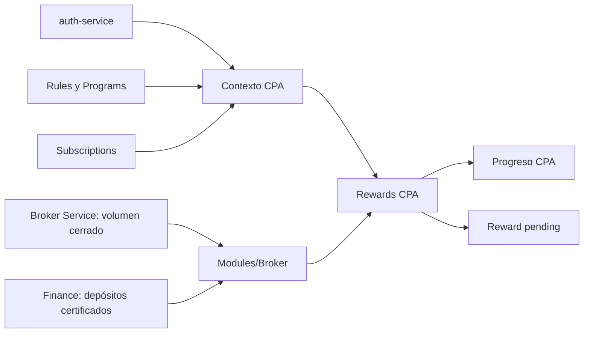

# Roadmap del feature Rewards

Estado: **RWD2/RV1-RV3, RWD3.1/RWD3.2 y RWD4.1 implementados; RWD4.2a implementado localmente; RWD-A1 completada, RWD-A2 en curso (A2.1 completada); runner económico/cierre PnL bloqueados**
Dependencias: `Rules R2`, `Subscriptions S1`, Modules M5, `auth-service` V1 y
Finance interno para depósitos certificados
Última revisión: 2026-10-02

## Objetivo

`Rewards` registra las obligaciones económicas de IB y conserva su causa,
snapshot y estado. Finance es autoridad del settlement. RWD2 crea la obligación
CPA `pending`; RWD3.1 la asienta de forma síncrona e idempotente en Finance.
RWD3.2 incorpora reversas, compensaciones y cancelación con validación contractual
pendiente. La nueva alineación documental no cambia esos comportamientos.

## Posición en la secuencia

Auth origina el contexto CPA. Rules, Programs y Subscriptions fijan su
configuración comercial. Modules/Broker obtiene evidencia normalizada desde
Broker Service y Finance; Rewards la interpreta y conserva el progreso y el
ledger.

## RWD1 — inventario

| Etapa | Documento | Estado |
| --- | --- | --- |
| 1. Inventario de casos de uso | [`01-use-case-inventory.md`](01-use-case-inventory.md) | Completado y corregido |

## RWD2 — verificación CPA, progreso y ledger `pending`

| Etapa | Documento | Estado |
| --- | --- | --- |
| 2. Modelo de dominio | [`02-cpa-domain-model.md`](02-cpa-domain-model.md) | Listo |
| 3. Entregas verticales | [`03-cpa-vertical-deliveries.md`](03-cpa-vertical-deliveries.md) | Listo |
| 4. Modelo de datos | [`04-cpa-data-model.md`](04-cpa-data-model.md) | Listo |
| 5. Implementación y contract tests | [`05-cpa-implementation-plan.md`](05-cpa-implementation-plan.md) | RV1-RV3 implementados; contract tests pendientes |

## RWD3 — settlement de Rewards

| Etapa | Documento | Estado |
| --- | --- | --- |
| 6. Settlement síncrono CPA | [`06-rwd3-settlement-sync.md`](06-rwd3-settlement-sync.md) | RWD3.1 implementado; validación contractual pendiente |
| 7. Correcciones y reconciliación selectiva | [`07-rwd3-corrections-and-reconciliation.md`](07-rwd3-corrections-and-reconciliation.md) | RWD3.2 implementado; validación contractual pendiente |

## RWD4 — volumen tradeado y PnL negativo

| Etapa | Documento | Estado |
| --- | --- | --- |
| 8. Descubrimiento, contratos y entregas | [`08-rwd4-volume-and-negative-pnl.md`](08-rwd4-volume-and-negative-pnl.md) | RWD4.1 implementado; RWD4.2a local con S2S pendiente; runner/cierre RWD4.2 bloqueados |

## Alineación previa a PnL

| Etapa | Documento / evidencia | Estado |
| --- | --- | --- |
| RWD-A1: alineación documental | [`09-rwd-a1-documentation-alignment.md`](09-rwd-a1-documentation-alignment.md) | Completada; no cambia código |
| RWD-A2: refactor CPA/volumen | [`10-rwd-a2-cpa-volume-refactor.md`](10-rwd-a2-cpa-volume-refactor.md) | En curso; A2.1 completada |
| Ampliación del corte histórico Broker–IB | [Dependencia y criterios en RWD4](08-rwd4-volume-and-negative-pnl.md) | Pendiente de implementación y evidencia S2S |
| RWD4.2: runner económico/cierre | [RWD4.2](08-rwd4-volume-and-negative-pnl.md) | Bloqueada por A2, cortes históricos e IAM |

Cada modalidad conserva su UseCase; factories de evidencia y cálculo son
independientes. Rules mantiene definiciones versionadas. No hay pipeline común
obligatorio ni engine universal. A2.1 implementa la factory económica CPA;
el cálculo de volumen y las factories de proveedores siguen pendientes en A2.

## Decisiones confirmadas

- La captura CPA permanece idempotente por referido e IB y congela requisitos,
  versión de regla y símbolos/grupos CPA.
- CPA no participa en Progression, pesos ni red multinivel.
- El módulo Broker obtiene volumen cerrado de Broker Service y depósitos
  certificados directamente de Finance; Broker Service no compone depósitos.
- Los requisitos de volumen y depósito se satisfacen acumulativamente y sin FX.
- Cada contexto tiene un solo progreso visible. `reward_id` se conserva en
  `cpa_context`, nunca en el progreso.
- Una evaluación calificada crea una única Reward `pending`; RWD3.1 la envía a
  Finance con idempotencia estable y transiciona a `settled` solo ante comisión
  `posted` creada o duplicada.
- `pending` y `failed` son seleccionables por el runner de settlement; Finance conserva el asiento y IB conserva solo su resumen operativo.
- Cancelación, reversa y compensación son administrativas, idempotentes y auditables. La reconciliación recurrente solo trata incertidumbre u holds, nunca el histórico financiero confirmado.

## Próximo paso

Completar volumen y factories de proveedores de RWD-A2 sin cambios de negocio y completar la ampliación/evidencia S2S
de cortes históricos Broker–IB y profundidad IAM. Solo al satisfacer ambos gates
se habilita el runner económico RWD4.2. Validación CPA/RWD3 y correcciones
funcionales del cierre E2E siguen independientes, registradas en A2; el plan E2E
posterior queda subordinado a esta secuencia.
