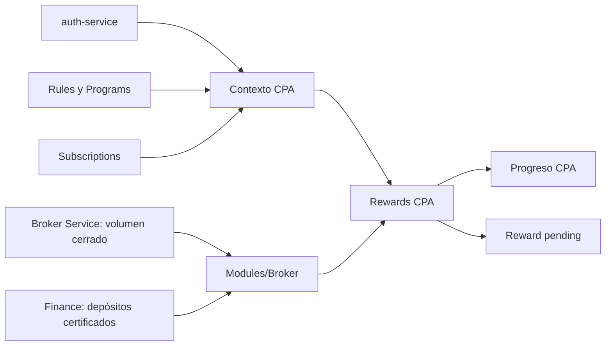

# Roadmap del feature Rewards

Estado: **RWD1 inventariado; RWD2/RV1-RV3 y RWD3.1 implementados; validación contractual pendiente**
Dependencias: `Rules R2`, `Subscriptions S1`, Modules M5, `auth-service` V1 y
Finance interno para depósitos certificados
Última revisión: 2026-09-30

## Objetivo

`Rewards` registra las obligaciones económicas de IB y conserva su causa,
snapshot y estado. Finance es autoridad del settlement. RWD2 crea la obligación
CPA `pending`; RWD3.1 la asienta de forma síncrona e idempotente en Finance.
Reversas, compensaciones y cancelación permanecen fuera de esta entrega.

## Posición en la secuencia

Auth origina el contexto CPA. Rules, Programs y Subscriptions fijan su
configuración comercial. Modules/Broker obtiene evidencia normalizada desde
Broker Service y Finance; Rewards la interpreta y conserva el progreso y el
ledger.

## RWD1 — inventario

| Etapa | Documento | Estado |
| --- | --- | --- |
| 1. Inventario de casos de uso | [`01-use-case-inventory.md`](01-use-case-inventory.md) | Completado y corregido |

## RWD2 — verificación CPA, progreso y ledger `pending`

| Etapa | Documento | Estado |
| --- | --- | --- |
| 2. Modelo de dominio | [`02-cpa-domain-model.md`](02-cpa-domain-model.md) | Listo |
| 3. Entregas verticales | [`03-cpa-vertical-deliveries.md`](03-cpa-vertical-deliveries.md) | Listo |
| 4. Modelo de datos | [`04-cpa-data-model.md`](04-cpa-data-model.md) | Listo |
| 5. Implementación y contract tests | [`05-cpa-implementation-plan.md`](05-cpa-implementation-plan.md) | RV1-RV3 implementados; contract tests pendientes |

## RWD3 — settlement de Rewards

| Etapa | Documento | Estado |
| --- | --- | --- |
| 6. Settlement síncrono CPA | [`06-rwd3-settlement-sync.md`](06-rwd3-settlement-sync.md) | RWD3.1 implementado; validación contractual pendiente |

## Decisiones confirmadas

- La captura CPA permanece idempotente por referido e IB y congela requisitos,
  versión de regla y símbolos/grupos CPA.
- CPA no participa en Progression, pesos ni red multinivel.
- El módulo Broker obtiene volumen cerrado de Broker Service y depósitos
  certificados directamente de Finance; Broker Service no compone depósitos.
- Los requisitos de volumen y depósito se satisfacen acumulativamente y sin FX.
- Cada contexto tiene un solo progreso visible. `reward_id` se conserva en
  `cpa_context`, nunca en el progreso.
- Una evaluación calificada crea una única Reward `pending`; RWD3.1 la envía a
  Finance con idempotencia estable y transiciona a `settled` solo ante comisión
  `posted` creada o duplicada.
- `pending` y `failed` son seleccionables por el runner de settlement; Finance
  conserva el asiento y IB conserva solo su resumen operativo.

## Próximo paso

Validar el envelope real de `auth.account.registered` V1 y los contratos de
Broker Service y Finance, incluido `ib/commission-events`, antes de cerrar
RWD2/RWD3.1. RWD3.2 tratará reversas, compensaciones, cancelación y
reconciliación.
