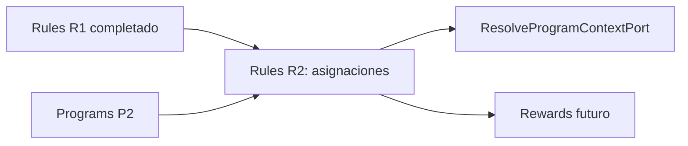

# Rules R2: planificación de la segunda entrega

Estado: **Completado**
Dependencia satisfecha: `Rules R1` y `Programs P2` completados
Última revisión: 2026-09-15

## Objetivo

Cerrar las asignaciones administrativas de una versión publicada a un
programa y módulo del mismo plan. R2 introduce historial inmediato: crear
activa ahora; reemplazar cierra la vigente y abre otra; retirar solo cierra.

## Decisiones cerradas

- Una asignación activa por combinación `regla + programa + módulo`.
- Distintas reglas pueden coexistir en el mismo programa y módulo; la
  precedencia de evaluación queda pendiente en el BDS.
- El módulo debe estar habilitado por el plan y seleccionado por el programa
  (`BR-RULE-005`, `BR-RULE-010`).
- Scope persistido como `all`; scopes instrumentales esperan Modules M2.
- Vigencia `[starts_at, ends_at)` en UTC; `ends_at` nulo = activa.
- R2 origina el primer puerto público de Programs hacia Rules.
- Sin Kafka, sin evaluación, sin contratos públicos de Rules.

## Documentos de la iteración R2

| Etapa | Documento | Estado |
| --- | --- | --- |
| Inventario | [`07-r2-use-case-inventory.md`](07-r2-use-case-inventory.md) | Completado |
| Dominio | [`08-r2-domain-model.md`](08-r2-domain-model.md) | Completado |
| Entregas verticales | [`09-r2-vertical-deliveries.md`](09-r2-vertical-deliveries.md) | R2 completado |
| Modelo de datos | [`10-r2-data-model.md`](10-r2-data-model.md) | Completado |
| Implementación | [`11-r2-implementation.md`](11-r2-implementation.md) | R2 completado |

## Fuera de R2

- Evaluación, Rewards, CPA y Progression.
- Scope instrumental explícito y Modules M2.
- Precedencia entre reglas concurrentes.
- Eventos Kafka y puertos públicos de Rules.
- Suscripciones y placement.

## Próximo paso

Ninguno dentro de R2. Evidencia en
[`11-r2-implementation.md`](11-r2-implementation.md). Subscriptions/placement
quedan fuera de esta entrega.
