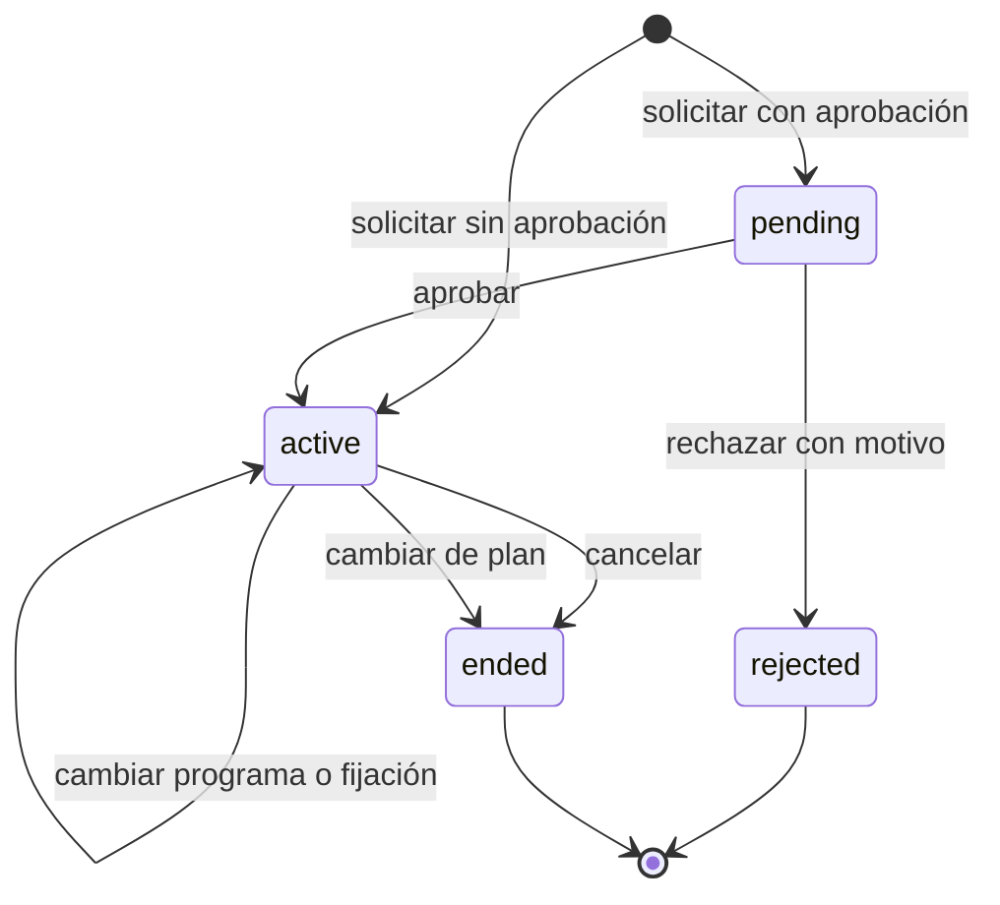

# Subscriptions S1: agregados, estados y transacciones

Estado: **Completado para S1**
Dependencia satisfecha: [`01-use-case-inventory.md`](01-use-case-inventory.md)
Última revisión: 2026-09-15

## Propósito

Definir el límite del agregado, sus estados e invariantes y las decisiones
indivisibles de S1. Los nombres describen responsabilidades de dominio y no
obligan todavía a una clase, tabla o endpoint homónimo.

## Agregados confirmados

| Concepto | Responsabilidad | Decisión |
| --- | --- | --- |
| `Subscription` | Conserva la solicitud, su estado, el usuario y plan, la decisión administrativa y, cuando está activa, su placement. | Agregado raíz de S1. |
| `Placement` | Representa el programa efectivo y si está libre o fijado administrativamente. | Parte interna de `Subscription`; no se modifica ni persiste de forma independiente. |
| Historial administrativo | Conserva cambios de estado, plan, programa y fijación con actor, instante y motivo cuando aplica. | Hijos inmutables del agregado. |
| `Plan` | Gobierna disponibilidad, archivo y requisito de aprobación. | Agregado externo consultado mediante frontera pública. |
| `Program` | Provee pertenencia al plan, posición y programa por omisión. | Agregado externo consultado mediante frontera pública. |

La solicitud y la suscripción no son agregados distintos. Un mismo registro
comienza como `pending` o `active` y conserva su identidad hasta alcanzar un
estado terminal.

## Estados de Subscription

| Estado | Placement | Mutaciones admitidas |
| --- | --- | --- |
| `pending` | No existe | Aprobar o rechazar administrativamente. |
| `active` | Obligatorio | Cancelar, cambiar de plan o programa, fijar o liberar placement. |
| `rejected` | No existe | Ninguna; estado terminal. |
| `ended` | Conserva el último contexto | Ninguna; estado terminal. |

`pending` y `active` son estados abiertos. Un usuario solo puede tener una
suscripción abierta globalmente. `rejected` y `ended` son inmutables, no se
reactivan y no se eliminan.

## Condición del placement

| Condición | Significado |
| --- | --- |
| `unfixed` | Progression puede ejecutar runs y cambiar el programa. |
| `fixed` | El programa permanece efectivo y no se ejecutan runs de Progression. |

Solo una suscripción `active` tiene placement. Cambiar entre `unfixed` y
`fixed` no cambia la identidad de la suscripción.

## Invariantes

- Como máximo existe una suscripción `pending` o `active` por usuario
  (`BR-SUBSCRIPTION-003`).
- Una solicitud nueva referencia un plan activo y no archivado. El usuario
  selecciona el plan, nunca el programa (`BR-SUBSCRIPTION-004`).
- El requisito de aprobación se captura al solicitar y no cambia si el plan se
  reconfigura después (`BR-PLAN-017`). Aprobar revalida que el plan continúe
  activo y no archivado (`BR-SUBSCRIPTION-018`).
- Una solicitud `pending` no tiene placement. Una `active` siempre referencia
  un programa existente de su mismo plan (`BR-PROGRAM-001`).
- La activación automática exige poder resolver el primer programa del ladder.
  La aprobación administrativa puede elegir otro programa existente; si no lo
  hace, usa el primero (`BR-SUBSCRIPTION-005`, `018`).
- Rechazar exige motivo. Fijar, cambiar o liberar una fijación conserva actor e
  instante; el motivo es opcional y se conserva cuando se proporciona
  (`BR-SUBSCRIPTION-014`, `019`).
- Solo administración muta una suscripción después de creada
  (`BR-SUBSCRIPTION-020`).
- Cambiar de plan no muta la identidad ni el plan histórico de la suscripción:
  termina la activa y crea otra, sin transferir puntos
  (`BR-SUBSCRIPTION-006`–`008`).
- Una fijación bloquea todos los runs de Progression y excluye definitivamente
  su actividad del progreso, pero no bloquea Rewards
  (`BR-SUBSCRIPTION-015`, `016`).
- Liberar una fijación no mueve el placement; el próximo run solo puede usar
  actividad elegible posterior a la liberación (`BR-SUBSCRIPTION-017`).
- La ocurrencia de la actividad determina su suscripción y placement, incluso
  si se procesa después de una transición (`BR-SUBSCRIPTION-011`).
- Desactivar un plan conserva suscripciones abiertas, pero bloquea nuevos runs
  de Progression y cálculos o pagos de Rewards. Archivarlo exige que no existan
  suscripciones abiertas (`BR-SUBSCRIPTION-022`, `023`).

## Transiciones

Un cambio de plan produce además una nueva `Subscription` en estado `active`.
No atraviesa `pending`, porque es una decisión administrativa, aunque el plan
destino exija aprobación para solicitudes iniciadas por usuarios.

## Límites transaccionales

- **Solicitar con aprobación:** valida plan y exclusión global; crea una
  `Subscription pending` con el requisito de aprobación capturado.
- **Solicitar sin aprobación:** valida plan, exclusión global y primer programa;
  crea una `Subscription active` con placement `unfixed`. Si falta programa, no
  deja registro parcial.
- **Aprobar:** revalida que el plan siga activo y no archivado, resuelve un
  programa existente del plan y cambia `pending` a `active` con placement
  `unfixed`. Cualquier fallo conserva `pending`.
- **Rechazar:** cambia `pending` a `rejected` y registra decisión y motivo en la
  misma operación.
- **Cancelar:** cambia `active` a `ended` y conserva el último placement y la
  causa de terminación.
- **Cambiar de plan:** valida plan y programa destino, termina la suscripción
  activa y crea la nueva `active` en una sola transacción. Un fallo revierte
  ambos efectos.
- **Cambiar programa:** valida pertenencia al mismo plan y reemplaza el
  placement efectivo sin recrear la suscripción. Si no se solicita fijación,
  Progression puede moverlo desde el siguiente run.
- **Fijar o cambiar programa fijado:** valida programa, actualiza placement y
  registra actor e instante, además del motivo opcional cuando se proporciona,
  de forma indivisible.
- **Liberar fijación:** cambia a `unfixed` y registra auditoría sin recalcular ni
  mover inmediatamente el placement.
- **Cambiar requisito de aprobación:** muta únicamente el Plan. No recorre ni
  reinterpreta solicitudes existentes.
- **Desactivar plan:** muta únicamente el Plan; los consumidores consultan su
  condición vigente antes de Progression o Rewards.
- **Archivar plan:** exige comprobar que no haya suscripciones abiertas y
  archivar sin una carrera con solicitudes o aprobaciones concurrentes.

La exclusión global por usuario debe serializar solicitudes, aprobaciones,
cancelaciones y cambios de plan concurrentes. El archivo del plan debe
serializarse con la creación o activación de suscripciones del mismo plan. El
mecanismo concreto se define en el modelo de datos; no puede depender solo de
una comprobación previa sin protección de concurrencia.

## Fronteras entre features

- Subscriptions consume de Plans existencia, disponibilidad, archivo y el
  requisito de aprobación vigente.
- Subscriptions consume de Programs pertenencia al plan, existencia y resolución
  del primer programa del ladder.
- Plans consume una consulta pública de Subscriptions para impedir el archivo
  cuando exista alguna suscripción abierta. No accede a su repository.
- Progression y Rewards consumirán posteriormente contexto vigente e histórico
  de Subscription. Sus contratos se diseñarán con sus primeras entregas reales,
  no se publican en S1 de forma especulativa.
- Los cruces entre features usan puertos y datos contractuales versionados; no
  comparten modelos internos ni detalles de persistencia.

## Fuera del modelo S1

- Forma de tablas, restricciones, índices y locks concretos.
- Rutas HTTP, Commands, Resources y forma exacta de consultas paginadas.
- Contratos definitivos para Progression y Rewards.
- Versiones futuras de planes y su aplicación a suscripciones existentes.
- Ventanas, reversas y correcciones de actividad tardía.

## Criterios de salida

- Agregado, estados e invariantes de S1 están definidos y trazados al BDS.
- Cada intención aceptada en el inventario tiene una transición o lectura
  coherente.
- Los cambios de plan y las exclusiones por usuario o plan tienen límites
  transaccionales explícitos.
- Las fronteras con Plans y Programs están definidas sin publicar contratos
  especulativos para Progression o Rewards.
- El alcance permite diseñar las entregas verticales de S1.
