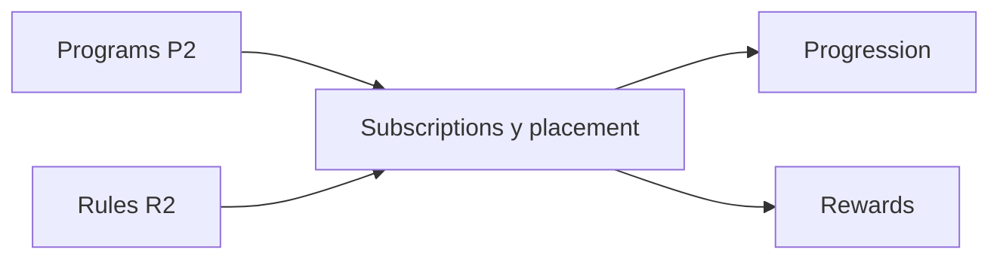

# Roadmap del feature Subscriptions

Estado: **Implementación en curso; sesión 3 completada**
Dependencias satisfechas: `Programs P2` y `Rules R2` completados
Dependencia de implementación: extensión de Plans para `BR-PLAN-017` (sesión 1)
Última revisión: 2026-09-15

## Objetivo

`Subscriptions` gobierna la relación histórica de un usuario IB con un plan y
su placement dentro del ladder. Debe permitir una única suscripción abierta,
conservar suscripciones terminadas y distinguir el placement libre del fijado
administrativamente sin mezclar Progression con Rewards.

## Posición en la secuencia

Programs aporta el ladder vivo y Rules las asignaciones históricas por programa
y módulo. Subscriptions aporta el contexto vigente e histórico que necesitan
Progression y Rewards.

## Estado de la iteración

| Etapa | Documento | Estado |
| --- | --- | --- |
| 1. Inventario de casos de uso | [`01-use-case-inventory.md`](01-use-case-inventory.md) | Completado para S1 |
| 2. Agregados, estados y transacciones | [`02-domain-model.md`](02-domain-model.md) | Completado para S1 |
| 3. Entregas verticales | [`03-vertical-deliveries.md`](03-vertical-deliveries.md) | Completado para S1 |
| 4. Modelo de datos | [`04-data-model.md`](04-data-model.md) | Completado para S1 |
| 5. Implementación y contract tests | [`05-s1-implementation.md`](05-s1-implementation.md) | En curso; sesión 3 completada |

## Decisiones confirmadas

- Un usuario tiene como máximo una suscripción abierta global: `pending` o
  `active`.
- Una suscripción nueva exige un plan activo y no archivado.
- El usuario solicita solo el plan. Si este no requiere aprobación, la
  suscripción se activa con el primer programa; si la requiere, administración
  aprueba, o rechaza con motivo, y elige el programa o usa el primero.
- El requisito de aprobación vigente al solicitar no cambia después.
- Los planes existentes y las creaciones que omitan `requires_approval` usan
  `true`; omitirlo al actualizar conserva el valor vigente.
- Cambiar de plan termina la suscripción anterior y crea otra de forma
  indivisible, sin transferir puntos ni reactivar historia previa.
- Cancelar termina la suscripción sin crear otra.
- `rejected` y `ended` son terminales, inmutables y permanentes; no existe
  `retiring` en esta fase.
- El usuario solo ve su suscripción abierta; administración consulta todos los
  estados y el historial.
- Desactivar un plan conserva suscripciones abiertas, pero suspende Progression
  y Rewards. Para archivarlo no puede quedar ninguna abierta.
- La actividad tardía conserva el contexto vigente cuando ocurrió.
- La fijación administrativa suspende Progression y excluye definitivamente de
  progreso la actividad del intervalo, pero no suspende Rewards.
- Al liberar una fijación, el siguiente run ordinario puede volver a mover el
  placement con actividad elegible posterior.
- Toda mutación administrativa conserva actor e instante. Solo el rechazo
  exige motivo; las demás acciones lo conservan cuando se proporciona.
- S1 se habilita completa, con permisos propios para customer y administración;
  no expone solicitudes pendientes sin su moderación administrativa.

## Fuera de esta etapa

- Cancelación, cambio de plan/programa, fijación y cierre integral de S1
  (sesiones 4–5).
- Cálculo de contribuciones, ejecución de runs y cálculo o pago de rewards.
- Aplicación de versiones futuras de planes a suscripciones existentes.
- Ventanas, actividad tardía y reversas propias de Progression o Rewards.
- Sistema transversal de registro de acciones y configuración persistida de
  dominios.

## Referencias canónicas

- [`plans-and-subscriptions.bds.md`](../../bds/plans-and-subscriptions.bds.md)
- [`progression.bds.md`](../../bds/progression.bds.md)
- [`rewards.bds.md`](../../bds/rewards.bds.md)
- [`architecture.md`](../../rules/architecture.md)

## Próximo paso

Continuar S1 con la sesión 4 de
[`05-s1-implementation.md`](05-s1-implementation.md) (ciclo de vida
administrativo), sin habilitar la capacidad hasta cerrar la sesión 5.
